# Карьера программиста после 30

Всё изначально пошло не так.

После окончания школы было желание пойти на программиста, но бесплатного очного обучения в городе исхода не было, а образование нужно было получать именно бесплатное и именно высшее. Первый пункт был обусловлен экономическими причинами – конец девяностых, денег у родителей нет, второй пункт – желание родителей дать своему чаду образование "потому что без образования на хорошую работу не возьмут". Я на тот момент ничего не понимал в жизни, не было ни малейшего представления, что мне нравится, а что нет. Школьные предметы не вызывали никаких особенных чувств, хотелось просто быстрее вырваться из-под родительской опеки, чтобы наконец стать самостоятельным.

Оглядываясь назад, я считаю, что это был самый главный просчёт родителей – посчитать, что само только наличие высшего образования решает все проблемы с работой и устройством в жизни. По факту эта "корочка", на которую я потратил 5 лет своей жизни ни разу не пригодилась – я её всегда предъявлял в самый последний момент, когда расписывался в трудовом договоре. Это было просто как напоминание о том, что "ты смог". Но с таким же успехом я мог бы потратить 5 лет на что-то другое – на изучение компьютерных программ и мануалов. Мне было бы достаточно иметь опытного наставника. Но наставника не было, как не было и возможности учиться в желанном вузе на желанной профессии.

С другой стороны, это было другое время: компьютерщиками становились почти всегда "ботаны", а "ботанами" во дворе в тот момент было быть "западло". Оплата у сисадминов была как у обслуживающего персонажа – небольшая, в отличие от манагеров на местном градообразующем предприятии. Трудно было представить, что вчерашние сисадмины в растянутых свитерах и баклашками пива за шкафом станут хипстерами, героями нашего времени, про которые будут снимать фильмы. Россия девяностых требовала юристов и экономистов, чтобы было кем латать дыры, оставленные разграбленным "постсовком".

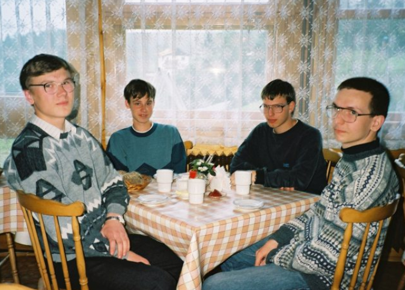
*Я мог бы быть здесь*

Короче говоря, сейчас я могу только жалеть о том, что не начал карьеру программиста ещё тогда. Это было той точкой невозврата, в которую хотелось бы вернуться и попытаться что-то изменить. Поэтому, если у вас сейчас стоит вопрос, поддаться обстоятельствам или идти своей дорогой – идите своей дорогой, она вернее вас приведёт к самореализации. А если у вас не получится, то вы будете спокойны, потому что сделали, что смогли.

А мы вернёмся обратно в мою юность, в момент, где я стою перед дверями университета, чтобы сделать выбор, который меня потом не порадует.

Опыт программирования на тот момент был почти нулевой, компьютера дома не было, но было несколько завершённых занятий по Turbo Pascal – курс программирования для школьников в местном компьютерном центре, на который мне удалось попасть, но который был успешно заброшен – рисовать с помощью кода кружочки и квадратики не было никакого желания.

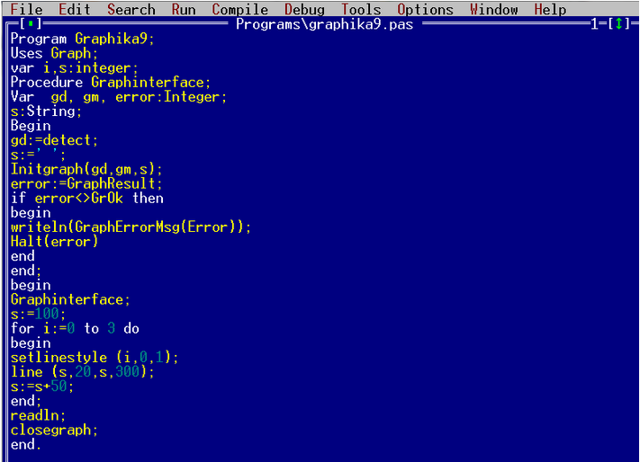
*ЯП Pascal*

В школе информатика была, но также не вызывала особо восторга – мне удалось пощупать "Агат" - нашему классу несколько раз доводилось побывать на ознакомительных лекциях, где мы даже сыграли с компьютером в шахматы, а хотелось бы, конечно, оставаться там после уроков, да почаще, но увы такой опции не было.

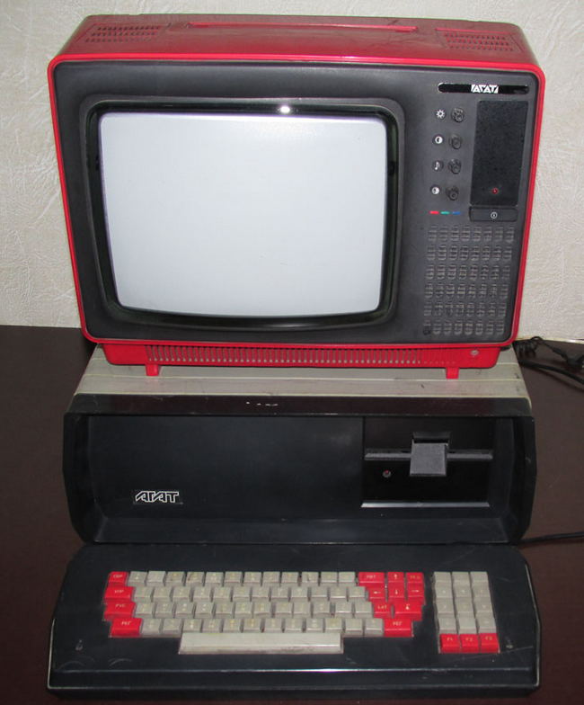
*Компьютер Агат https://profit.kz/articles/2043/Muzej-starih-EVM*

Чуть позже по знакомству я попал в компьютерный класс детского сада – и там, о чудо, были установлены российские "Электроники", с которых, собственно, и началось моё более-менее близкое знакомство с компьютерами и компьютерными играми.

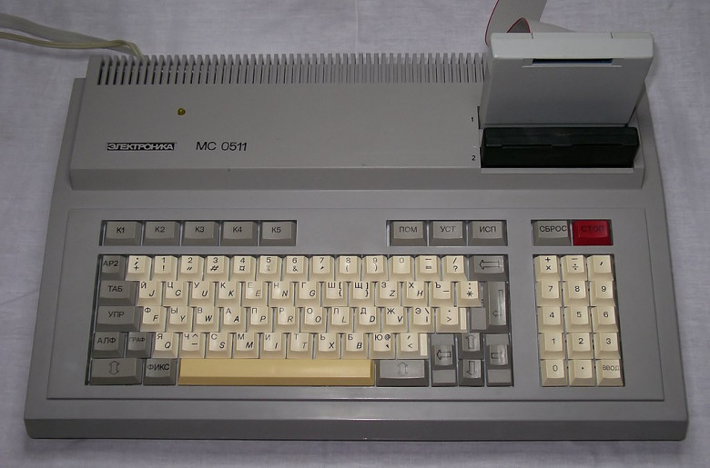
*Компьютер Электроника*

Ещё по знакомству мне удалось пару раз заценить ZX Spectrum, который произвёл на меня неизгладимое впечатления кассетами, на которые (подумать только!) были записаны данные! Вот это магия! Нажимаешь Play на "кассетнике", смотришь перемигивающиеся картинки и ждёшь, когда магия свершится и на экране появится игра.

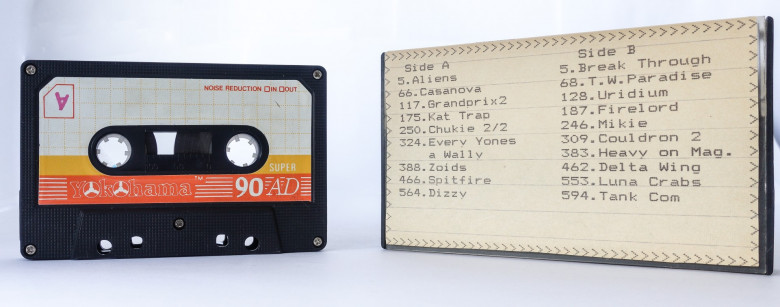
*Кассета для ZX Spectrum https://habr.com/ru/company/kaspersky/blog/429096/*

Спустя какое-то время компьютерный класс в школе модернизировали и туда поставили настоящие IBM-совместимые, первые Pentium и Celeron. Вместе с этим начинается довольно скучное изучение компьютерной теории и ЯП Basic всё с теми же кружочками и квадратиками.

*ЯП Basic*

Школьные учителя делали всё возможное, чтобы не заинтересовать программированием.

Дальше я пошёл на платные курсы подготовки к ЕГЭ, и первое, на что я обратил внимание, что преподаватели хороши – в них полно энергии, юмора и желания учить. За три месяца моя тройка по физике превратилась в пятёрку. Математика не так чтобы сильно улучшилась – физико-математический класс, в котором я учился, имел довольно высокий уровень – моя ленивая с натяжкой четвёрка, которой я достиг практически без усилий, меня не сильно тревожила.

Благодаря курсам и домашней подготовке, я смог поступить в университет бесплатно. Пошёл на экономическую специальность, так как мне казалось, что это наименьшее зло. В университете компьютерный класс был уже лучше – там можно было по близкому знакомству поиграть в кооперативные Half-Life и первый StarCraft.

На втором курсе университета родители купили мне мой первый компьютер – это был Celeron (первый или второй – точно не помню) с дискретной видеокартой 8Mb и Windows 98 на борту. Примерно тогда я почти выучил тот самый серийный код установщика Windows, потому что жажда исследования толкала меня на исследования из серии "без каких файлов ось может продолжить жить", а ещё я коллекционировал и часто использовал утилиты, "которые-улучшат-вашу-windows-и-исправят-все-ошибки", потому что хотелось, чтобы компьютер работал быстрее. Чуть позже я пробовал разные инструменты 3D-моделирования, но программирование меня всё ещё не воодушевляло.

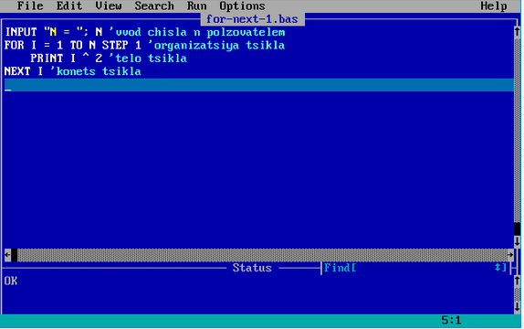
*Пиратские диски https://pikabu.ru/story/piratskie_diski__nachalo_1316176*

За оставшихся три университетских года, несмотря на доступ к компьютеру, программирование не продвинулось ни на шаг.

Ну а дальше началась жизнь. Я попал на менеджерскую работу, честно старался выполнять свои задачи, а параллельно продолжал коситься в сторону мира разработки. Решил сделать свой сайт, скачал через скрипящее dial-up соединение мануал по HTML и сверстал с помощью тегов table сайт, который затем разместил на хостинге narod.ru. В тот же момент нашёл по аське друзей, с которыми неприлично много чатился.

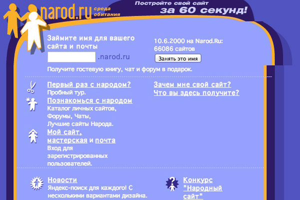

Спустя два года я бросаю менеджерскую карьеру, и бросаюсь в омут с головой. Довольный своим знанием HTML, я устраиваюсь веб-дизайнером. Это была авантюра! Все мемы про адских заказчиков дизайна сайта я прочувствовал на себе.

Последующие годы я верстал сайтики и делал дизайны, но я всё ещё не был программистом. Были проекты, которые я делал на MODx и Joomla, но это было скорее маленькое вкрапление программирования в большой монолит CMS. В целом мне всё ещё нравилось визуальное искусство, я планировал оставаться в русле выбранной профессии, пока однажды не понял, что что-то неуловимо изменилось. Дизайнеры сменили православный Photoshop и пиво на хипстерский Sketch и смузи. Я начал чувствовать себя вымирающим динозавром, который вместо того, чтобы стать королём горы за столько лет, так и не достиг вершины художественного стиля, который бы меня удовлетворил – все мои сайтики выходили недостаточно эстетичными, недостаточно стильными, а забугорный Sketch я заочно начал "хейтить" на основании того, что это не кроссплатформенный продукт.

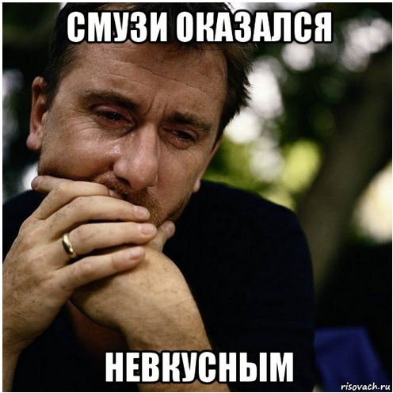

Последний поворот моей карьеры произошёл, когда я впервые самостоятельно решил начать писать на JavaScript, чтобы внедрить на сайт функционал, который не находился "гуглением" JQuery-плагинов. Спустя год я понял, что вернулся назад в прошлое, только мне уже не 17, а 33, и я снова стою на развилке, на которой уже стоял. Это снова была точка невозврата. Только на этот раз у меня был выбор – нивелировать всю свою предыдущую карьеру и начать с нуля, либо покупать макбук со скетчем.

Я выбрал первое. И это было мучительно. Мучительно и интересно. Как супергерой днём я был веб-дизайнер, вечером я был таящийся во тьме невежества начинающий программист, старательно гуглящий статьи, уроки, всё, что могло меня чему-то научить. Я нагуглил сотни курсов, составил план и даже прошёл некоторые из них. Но при этом продолжал себя ощущать недоделанным, неполноценным. Чуть позже я узнал про синдром самозванца, и я им действительно был. Сейчас я считаю, что, если вы чувствуете себя самозванцем, значит так оно и есть. Значит вам нужно сделать и выучить нечто такое, что позволит вам себя чувствовать увереннее!

Я продолжал учиться почти каждый вечер, все выходные напролёт я кодил, старался кодить, завёл миллион пет-проектов, часть из которых давно в мусорке. Я и сейчас много кодирую вечером после работы, но уже не так неистово, как в первые два года.

Затем я узнал про алгоритмы. Сначала была стадия неприятия, затем осознание, затем принятие. Затем погружение в Computer Science – тот самый, что так неудачно преподаётся в школе в своей базовой версии. Только теперь это мой любимый урок, на который хочется ходить.

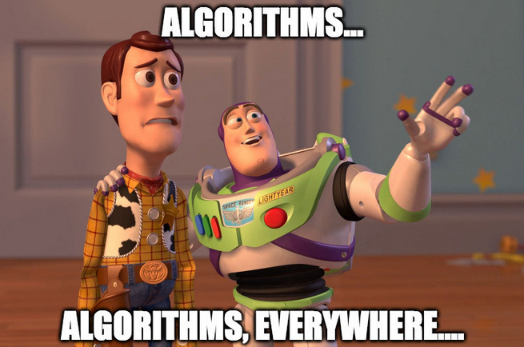

Подкасты, конференции, IT-блогеры – мир программирования пролился на меня как божья благодать. Я бежал по траве, где каждая травинка – этой чей-то проект, npm-пакет со своими мэйнтейнерами и чейнджлогом. Я вдыхал запах свежести восприятия, где бородатые кулхацкеры подобно титанам создают в подземных чертогах ПРОДУКТЫ и иногда выходят, чтобы благословить ньюкамеров и поведать о новых релизах. Поведать о новых клавиатурах, которые щёлкают с таким звуком и нажимаются таким образом, что ты испытываешь пальчиковый оргазм.

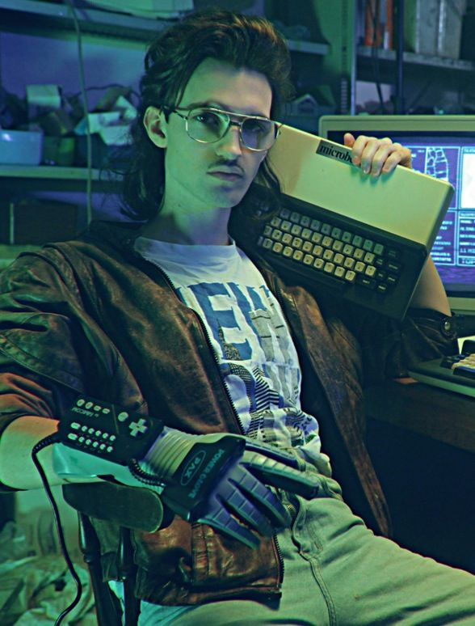

Я как будто спал, но проснулся. Я понял, что мой ленивый мозг всю жизнь ленился не потому что я такой, а потому что ему было не интересно. Теперь интересно выучить C++  за 21 день.

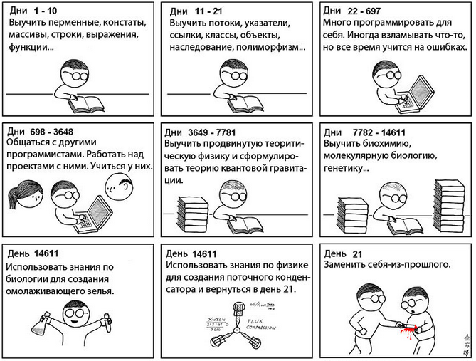

Но энергия не та. После тридцати, ближе к, страшно подумать, 40, приходится начинать экономить энергию. Закрывать лишние окна и вкладки. Стараться чаще бывать на воздухе, чтобы не превратиться в горбатого Голлума с кольцом Интернет-всевластия. Больше уделять семье, потому что самая большая ценность в наших жизнях – это наши близкие. Больше не хочется неразумно тратить энергию на всё подряд. Хочется сконцентрироваться только на важном.

В программировании мне нравится то, что есть некая ощутимая вершина, к которой можно стремиться. Если ты – веб-дизайнер, тебе самому трудно понять, хорош ты или плох, нет никаких метрик, кроме чувства вкуса окружающих тебя людей. Вся эта статистика, тепловые карты и прочее – кофейная гуща, а по факту на вкус и цвет фломастеры – разные! Короче, дизайн – это ОЧЕНЬ субъективно. Есть только некоторый набор правил дизайнера-джентльмена, неплохо сформулированный Аланом Купером, которого я лично считаю батей дизайна интерфейсов.

В программировании же, как в кунг-фу, есть набор техник, которыми ты можешь овладеть. На это могут уйти годы, но если тренироваться, то попадёшь в высшую лигу, чтобы у тебя появился шанс повлиять на мир с помощью кода, потому что ты будешь делать сверхпопулярный продукт.

Тут "бати" на каждом шагу, их много - людей, которые стали великими уже при жизни. Они пишут интересные книжки, читают лекции.

Короче, что я хотел сказать, что после 30 открывать для себя программирование - это круто.

P.S.

И, не смотря на весь этот текст, я не хочу рекомендовать программирование всем-всем-всем. Все люди, как и фломастеры, разные. Не ведитесь на обещания трудоустройства курс-мейкеров и сладкоречивые посулы-статьи HR-компаний. Успеха можно добиться только в деле, которое тебе действительно нравится.
