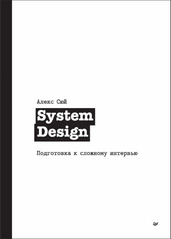
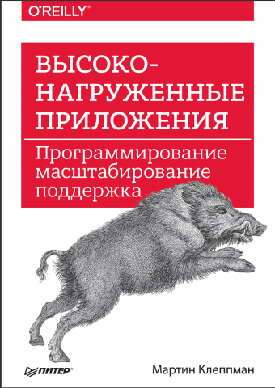

# Минимум книг, которые нужно прочитать начинающему или продолжающему свою кривую обучения программисту

## Предисловие

Ниже небольшой список книг, которые лично я могу рекомендовать для чтения всем программистам, в том числе начинающим. Как это обычно бывает, что купил, то и продаю.

## База Computer Science

### Теоретический минимум по Computer Science (Владстон Феррейра Фило)

Это супер-базированная книга, которая подойдёт как стартовая особенно тем, кто не получил профильного образования.

### Видео-курс CS50

Это великолепный гарвардский курс, предназначенный для начинающих. Собственно на его примере вы поймёте, почему люди стремятся попасть на учёбу в такие места как Гарвард. Видео-курс можно найти в открытом доступе в Интернете и даже получить сертификаты о его прохождении онлайн.

## Программирование

### Объектно-ориентированное мышление (Мэтт Вайсфельд)

Я бы охарактеризовал эту книгу как начальную для тех, кто хочет использовать ООП в своей работе. Я знаю, что эта книга не очень популярна, но мне лично она помогла в своё время "устаканить" некоторые концепции в голове.

### Паттерны проектирования (Эрик Фримен, Элизабет Робсон и другие)

Есть две версии этой книги - одна из них с картинками для наглядности. Весьма полезно для расширения кругозора.

### Чистый код (Роберт Мартин)

В книге вы найдёте набор правил, которые помогут вам писать понятный для себя и, что гораздо важнее в больших компаниях, понятый для других программистов код. Чем раньше вы эту книгу прочитаете, тем лучше.

### Экстремальное программирование. Разработка через тестирование (Кент Бек)

Иногда программисты пренебрегают тестированием (что плохо). Книга вдохновит вас писать тесты, ну или, по крайней мере, даст пищу для размышлений.

## Алгоритмы и структуры данных

### Грокаем алгоритмы (Адитья Бхаргава)

Даёт базовые представления об алгоритмах и структурах данных. Книга любима многими за свою простоту, с которой автор объясняет ключевые принципы. Если вы прочитаете, поймёте и реализуете всё, что в этой книге есть, то у вас не должно возникнуть проблем со следующей книгой.

### Карьера программиста (Г. Лакман Макдауэлл)

В основном эта книга предназначена для тех, кто проходит собеседования в крупные технологические компании. Много материала посвящено основной секции - алгоритмической.

## System Design

### System Design (Алекс Сюй)

Отлично структурированная книга, которую зачастую рекомендуют для прочтения перед прохождением интервью. В Интернете можно найти многочисленные диаграммы, описывающие самые разные айтишные вещи, от того же автора.

## High Load

### Высоко-нагруженные приложения (Мартин Клеппман)

Знаменитая "книга с кабанчиком", одна из фундаментальных книг для программиста, желающего именовать себя гордо Software Engineer.

## Менеджмент

### Делай как в Google

Книга даёт общие представления о разработке в технологических гигантах, таких как Google.

### Agile. Оценка и планирование проектов (Майк Кон)

В книге много воды, но вместе с тем там можно найти весьма детальные описания процессов взаимодействия в командах, работающих по Agile методологии.

## Послесловие

Было бы интересно увидеть ваш минимум книг в комментариях. Если есть какие-то замечания, постараюсь улучшить статью или позже опубликовать обновлённую версию.
