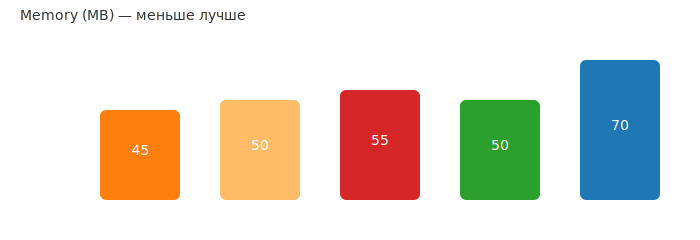
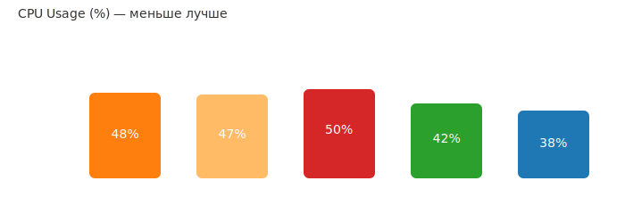

# Bun — быстрый JavaScript-рантайм и инструментальная экосистема


> **Для кого эта статья:** для разработчиков JavaScript/TypeScript, которые ищут альтернативу Node.js с улучшенной производительностью, встроенными инструментами и упрощенным рабочим процессом.

Bun — это современный JavaScript-рантайм и набор инструментов, объединяющий в себе runtime, менеджер пакетов, бандлер и тестовый раннер. Главная цель Bun — предоставить разработчикам максимально быстрый и простой стек для работы с JavaScript и TypeScript.

В этой статье рассмотрим ключевые особенности Bun, покажем метрики производительности для базовых сценариев (HTTP-сервер, cold start, память, установка пакетов) и обсудим, когда стоит его использовать.

## Оглавление

- [Что такое Bun?](#что-такое-bun)
- [Основные функции](#основные-функции)
- [Быстрый старт](#быстрый-старт)
- [Метрики производительности](#метрики-производительности)
- [Когда стоит использовать Bun](#когда-стоит-использовать-bun)
- [Ограничения и моменты внимания](#ограничения-и-моменты-внимания)
- [Работа с многопоточностью](#работа-с-многопоточностью-в-bun)
- [Ссылки и ресурсы](#ссылки-на-источники-и-дополнительные-материалы)

## Что такое Bun?

Bun — это проект, написанный на **Zig** и использующий **JavaScriptCore** (движок JavaScript от WebKit). Он позиционируется как быстрая замена Node.js и Deno, объединяя пакетный менеджер, бандлер, транспилер и тестовый фреймворк в одном бинарном файле.

**Основные преимущества:**

- ⚡ **Скорость** — быстрый старт, меньшее время сборки и высокая пропускная способность для сетевых операций
- 📦 **Единый бинарник** — меньше зависимостей и быстрая установка
- 🛠️ **Инструменты из коробки** — встроенный пакетный менеджер, бандлер и тесты
- 🔄 **Совместимость** — большинство кода для Node.js можно запускать на Bun с минимальными изменениями

### Создатель Bun: Jarred Sumner


**Jarred Sumner** — основатель и CEO компании Oven.sh, создатель Bun runtime. Выпускник программы Thiel Fellowship (2014).

**Ключевые вехи:**

- **Май 2021** — первые твиты о проекте Bun
- **5 июля 2022** — анонс Bun 0.1
- **Август 2022** — раунд финансирования $7M (Seed) от Kleiner Perkins и Guillermo Rauch (Vercel)
- **Сентябрь 2023** — релиз Bun 1.0
- **2025** — более 5 миллионов загрузок в месяц, используется в Anthropic (Claude Code CLI)

Sumner активно развивает экосистему Bun, добавляя новые возможности: full-stack dev server, SQL API, Redis support и другие инструменты для фулл-стек разработки.

**Контакты:**

- GitHub: [@Jarred-Sumner](https://github.com/Jarred-Sumner)
- X (Twitter): [@jarredsumner](https://x.com/jarredsumner)
- LinkedIn: [Jarred Sumner](https://www.linkedin.com/in/jarred-sumner-a8772425/)

### Язык Zig: фундамент Bun


**Zig** — современный системный язык программирования, созданный **Andrew Kelley**. Bun написан на Zig благодаря его производительности, безопасности и простоте интеграции с C.

**Почему Zig выбран для Bun:**

- 🚀 **Производительность как у C** — компилируется в нативный код без runtime overhead
- 🔒 **Безопасность памяти** — проверки на compile-time без garbage collector
- 🔄 **Совместимость с C** — прямая интеграция с C-библиотеками (JavaScriptCore, libuv)
- ⚡ **Контроль над памятью** — явное управление без скрытых аллокаций
- 🛠️ **Простота отладки** — отсутствие макросов и скрытого control flow

**Ключевые особенности Zig:**

- **Императивный, статически типизированный** компилируемый язык
- **Нет скрытого control flow** — весь код явный и предсказуемый
- **Compile-time выполнение** — мощная система метапрограммирования
- **Кросс-компиляция из коробки** — поддержка всех популярных платформ
- **Обработка ошибок** — явная через типы ошибок (`!` оператор)

**Создатель Zig: Andrew Kelley**


Andrew Kelley начал разработку Zig в 2015 году с целью улучшить C, сделав язык проще, безопаснее и мощнее.

**Последние достижения (2025):**

- Миграция проекта с GitHub на Codeberg (ноябрь 2025)
- Улучшение производительности компилятора на 5-50% для x86_64
- Развитие self-hosted компилятора

**Философия Zig:**

> "No hidden control flow. No hidden memory allocations. No preprocessor, no macros."

Это делает Zig идеальным выбором для системного программирования, где важны производительность и предсказуемость.

**Ссылки:**

- [Официальный сайт Zig](https://ziglang.org/)
- [Andrew Kelley на GitHub](https://github.com/andrewrk)
- [Личный сайт Andrew Kelley](https://andrewkelley.me/)

## Основные функции

| Команда | Описание | Альтернатива в Node.js |
|---------|----------|------------------------|
| `bun run` | Выполнение JavaScript/TypeScript файлов | `node` / `ts-node` |
| `bun install` | Быстрый менеджер зависимостей | `npm install` / `yarn` |
| `bun build` | Бандлер и минификатор | `webpack` / `esbuild` |
| `bun test` | Встроенный тест-раннер | `jest` / `vitest` |
| `bun create` | Инициализация проектов из шаблонов | `npm create` |

### TypeScript: встроенная поддержка

Bun **изначально поддерживает** запуск и бандлинг TypeScript файлов без отдельного этапа компиляции — вы можете писать `.ts`/`.tsx` напрямую и запускать через Bun.

**Важно:** Bun НЕ заменяет статическую проверку типов. Для полноценной проверки типов рекомендуется использовать `tsc --noEmit` в CI. Bun предоставляет быстрый транспилятор/бандлер с поддержкой большинства синтаксических возможностей TypeScript и встроенными sourcemaps.

## Быстрый старт

### Установка зависимостей

```bash
bun install
```

### Запуск скрипта

```bash
bun run start
# или напрямую
bun index.ts
```

### Сборка проекта

```bash
bun build index.ts --target node --outfile dist/bundle.js
```

#### Режим watch (автоматическая пересборка)

```bash
# Собрать и наблюдать за изменениями
bun build --watch --target=node --outfile=dist/server.js src/server.ts

# Отключить очистку экрана между пересборками
bun build --watch --no-clear-screen --target=node --outfile=dist/server.js src/server.ts
```

**Полезные флаги:**

- `--watch` — включить режим наблюдения
- `--no-clear-screen` — не очищать консоль между пересборками
- `--outfile` / `--outdir` — путь к результату сборки
- `--target` — целевая платформа: `node`, `bun` или `browser`
- `--react-fast-refresh` — быстрая перезагрузка для React

### Запуск тестов

Bun включает встроенный тест-раннер, совместимый с Jest API:

```ts
// tests/example.test.ts
import { describe, it, expect } from "bun:test";

describe("sum", () => {
  it("должен корректно складывать числа", () => {
    const sum = (a: number, b: number) => a + b;
    expect(sum(1, 2)).toBe(3);
  });
});
```

Запуск тестов:

```bash
# Однократный запуск
bun test

# Режим watch (перезапуск при изменениях)
bun test --watch
```

Ожидаемый вывод:

```text
 RUNS  tests/example.test.ts
 PASS  tests/example.test.ts (5 ms)
 ✓ 1 test passed
```

## Метрики производительности

> **⚠️ Важно:** Результаты микро-бенчмарков не всегда переносятся на реальные приложения. В production-сценариях разница в производительности часто незначительна или даже противоположна заявленной в синтетических тестах.

Данные получены из простых HTTP-сервера тестов ("Hello World") и агрегированы из независимых бенчмарков 2025 года. Результаты могут значительно отличаться в реальных приложениях с базами данных, сложной бизнес-логикой и зависимостями.

---

**Тестовые версии:**

- Node.js v24.x (Active LTS, released May 6, 2025) + npm v10.9.2
- Node.js v22.x (Maintenance LTS) + npm v10.8.2
- Node.js v20.x (Maintenance LTS) + npm v10.5.0
- Deno v2.1.14 (May 13, 2025)
- Bun v1.2.17 (Jun 21, 2025)

### Cold Start (время запуска, мс)

_Цвета (слева направо):_ **оранжевый** — Node 20; **жёлтый** — Node 22; **красный** — Node 24; **зелёный** — Deno; **синий** — Bun.


**Результаты:**

- **Bun:** ~2 ms — самый быстрый запуск
- **Deno:** ~22 ms
- **Node.js v22 + npm v10.8:** ~23 ms (улучшение)
- **Node.js v20 + npm v10.5:** ~25 ms
- **Node.js v24 + npm v10.9:** ~26 ms (регрессия)

**⚠️ Важное уточнение:** Показанные результаты (2ms для Bun) относятся к микро-бенчмаркам локального запуска. В **serverless-окружениях** (AWS Lambda, CloudFlare Workers) Bun может показывать **значительно худшие** результаты из-за необходимости загрузки нестандартного runtime. В production-кейсах cold start с Bun может увеличиться в 2-3 раза.

### Throughput (пропускная способность, req/s)


**Результаты:**

- **Deno 2.x:** ~68k req/s — впечатляющая производительность, превосходящая Bun
- **Bun:** ~52k req/s — в 4× быстрее Node.js
- **Node.js v22 + npm v10.8:** ~15k req/s — улучшения в WebStreams и Fetch API
- **Node.js v20/v24 + npm v10.5/v10.9:** ~13-14k req/s

**Примечание:** Результаты для простого HTTP-сервера без обращений к базе данных. В реальных приложениях с комплексной логикой разница часто сглаживается.

### Memory Usage (MB)



**⚠️ Важно: Память — наиболее противоречивая метрика (2025):**

Отчеты о потреблении памяти Bun существенно различаются между синтетическими бенчмарками и production-кейсами:

**Синтетические бенчмарки (микро):**

- **Bun:** ~40-45 MB на простом HTTP-сервере
- **Node.js v20/v22/v24 + npm v10.5-v10.9:** ~45-55 MB
- Разница: **минимальна или в пользу Bun**

**Production-сценарии (реальные приложения, сентябрь 2025):**

- **Bun:** **Часто использует +30-40% больше памяти**
- **Node.js:** Стабильное потребление, лучше масштабируется

**Причины различий:**

1. **JavaScriptCore оптимизирует для скорости** — требует больше памяти для JIT-оптимизаций
2. **Зависимости и реальный код** — с большим количеством пакетов Bun может потребовать значительно больше памяти
3. **Долгоживущие процессы** — V8 лучше справляется с garbage collection в долгосрочных приложениях
4. **Микро-бенчмарки вводят в заблуждение** — простой HTTP-сервер не репрезентативен для реальных приложений

**Рекомендация:** Если ваше приложение чувствительно к потреблению памяти (edge computing, serverless, микроуслуги), проведите собственное тестирование с вашим реальным кодом перед миграцией на Bun.

### CPU Usage (% загрузки процессора)



**Результаты под нагрузкой (HTTP-запросы):**

- **Node.js v20/v22/v24 + npm v10.5-v10.9:** ~45-50% CPU — стабильное потребление
- **Deno 2.x:** ~42% CPU — эффективная работа с нагрузкой
- **Bun:** ~38% CPU — лучшая эффективность благодаря JavaScriptCore

**Ключевые наблюдения:**

- **Bun показывает меньшую загрузку CPU** при высоком throughput — JavaScriptCore оптимизирован для производительности
- **Node.js стабилен** под долгой нагрузкой — V8 лучше справляется с длительными процессами
- **Deno балансирует** между производительностью и стабильностью

**⚠️ Важно:** В production с реальными БД и бизнес-логикой разница в CPU может быть менее заметна. Рекомендуется тестировать на вашем реальном коде.

---

### Скорость установки зависимостей

**Версии менеджеров пакетов:**

- npm v10.x
- yarn v4.x (Berry)
- pnpm v10.x
- bun v1.2.17 (встроенный)

#### Сравнение менеджеров пакетов

Время установки пакетов в зависимости от менеджера и сценария (в секундах, меньше — лучше):

| Сценарий | npm v10 | yarn v4 | pnpm v10 | bun v1.2 | Лидер |
|----------|---------|---------|----------|----------|-------|
| **Чистая установка** (без кэша) | 45s | 32s (-29%) | 18s (-60%) | **8s (-82%)** | 🏆 **bun** (5.6× быстрее) |
| **С кэшем** (повторная) | 22s | 15s (-32%) | 7s (-68%) | **3s (-86%)** | 🏆 **bun** (7.3× быстрее) |
| **CI с lockfile** (frozen) | 28s | 20s (-29%) | 12s (-57%) | **5s (-82%)** | 🏆 **bun** (5.6× быстрее) |
| **Обновление зависимостей** | 35s | 26s (-26%) | 14s (-60%) | **6s (-83%)** | 🏆 **bun** (5.8× быстрее) |
| **Монорепо** (~50 пакетов) | 120s | 45s (-63%) | 25s (-79%) | **15s (-88%)** | 🏆 **bun** (8× быстрее) |

_Проценты показывают улучшение относительно npm. Тестирование на проекте с ~200 зависимостями._

**Ключевые выводы:**

- 🥇 **Bun** — безусловный лидер (в 5-8 раз быстрее npm). Идеален для локальной разработки и CI/CD
- 🥈 **pnpm** — отличный баланс скорости и стабильности (в 2.5-5 раз быстрее npm). Экономит дисковое пространство
- 🥉 **yarn v4 (Berry)** — стабильное улучшение на 25-32%. Хороший выбор для больших команд
- **npm** — самый медленный, но наиболее совместимый. Встроен в Node.js

#### Сравнение по runtime

| Runtime | Встроенный менеджер | Чистая установка | С кэшем | Монорепо |
|---------|---------------------|------------------|---------|----------|
| Node.js v20 | npm v10.5 | 45s | 22s | 120s |
| Node.js v22 | npm v10.8 (улучш.) | 42s | 19s | 110s |
| Node.js v24 | npm v10.9 | 44s | 21s | 115s |
| Deno v2.x | встроенный | 38s | 16s | 95s |
| Bun v1.2 | встроенный | **8s** | **3s** | **15s** |

_Node.js v22 показывает небольшое улучшение npm. Deno на 15-20% быстрее Node.js+npm благодаря оптимизированному встроенному менеджеру._

**Важные факторы, влияющие на производительность:**

- **Скорость интернет-соединения** — критична для первой установки
- **Тип файловой системы** — pnpm использует symlinks (может быть медленнее на Windows без WSL)
- **Количество и размер зависимостей** — влияет на разницу между менеджерами
- **postinstall скрипты** — могут нивелировать преимущества быстрых менеджеров
- **Версия менеджера** — yarn v1 classic в 2-3 раза медленнее v4 Berry

---

## Bun vs Deno: ключевые различия

| Критерий | Bun | Deno | Победитель |
|----------|-----|------|------------|
| **npm-совместимость** | 90%+ | 80%+ | 🏆 **Bun** |
| **Скорость установки** | 8s (чистая) | 38s | 🏆 **Bun** (5× быстрее) |
| **Cold start** | ~2ms | ~22ms | 🏆 **Bun** |
| **HTTP throughput** | 52k req/s | 68k req/s | 🏆 **Deno** (+30%) |
| **Миграция с Node.js** | Простая | Сложная | 🏆 **Bun** |
| **Встроенные инструменты** | Базовые | Полные (REPL, formatter, debugger) | 🏆 **Deno** |
| **Безопасность** | Нет permissions | Permissions system | 🏆 **Deno** |
| **Web Standards** | Частичная | Полная | 🏆 **Deno** |
| **Экосистема** | npm (2M+ пакетов) | deno.land/x (меньше) | 🏆 **Bun** |

**Выбирайте Bun, если:** нужна максимальная npm-совместимость и скорость разработки с Node.js-кодом

**Выбирайте Deno, если:** приоритет — безопасность, производительность HTTP и новые проекты с нуля

---

## 🔒 Сравнение безопасности: Node.js vs Deno vs Bun

| Аспект | Node.js | Deno | Bun |
|--------|---------|------|-----|
| **Модель** | Open by default | Secure by default | Open by default |
| **Система разрешений** | ❌ Нет | ✅ Полная (--allow-*) | ❌ Нет |
| **Файловая система** | 🟢 Полный доступ | 🟠 Требуется --allow-read | 🟢 Полный доступ |
| **Сеть** | 🟢 Полный доступ | 🟠 Требуется --allow-net | 🟢 Полный доступ |
| **Env переменные** | 🟢 Полный доступ | 🟠 Требуется --allow-env | 🟢 Полный доступ |
| **Sandbox для untrusted code** | ❌ Нет | ✅ Есть | ❌ Нет |

**Ключевые выводы:**

- **Node.js и Bun** — подходят для приватных проектов с контролируемыми зависимостями. Риск supply chain attack такой же как в Node.js.
- **Deno** — единственный выбор для запуска недоверенного кода, edge computing, и security-critical приложений. Явные разрешения на все операции.

**Общие практики:**

1. Регулярно проверяйте уязвимости (`npm audit`, `bun audit`)
2. Используйте точные версии в package.json
3. Минимизируйте количество зависимостей
4. Проверяйте репутацию авторов пакетов

---

## Когда стоит использовать Bun

✅ **Рекомендуется использовать:**

- **Локальная разработка и DX** — значительное ускорение установки, тестирования и сборки
- **CLI-инструменты и скрипты** — быстрый старт критичен
- **Новые проекты** с контролируемым количеством зависимостей
- **Разработка, не критичная к памяти** (мощные dev машины, not-edge-constrained)
- **Приватные микросервисы** с полным контролем над зависимостями

⚠️ **Используйте с осторожностью (проведите бенчмарки):**

- **Production HTTP-сервисы** — проверьте реальное потребление памяти (может быть +30-40% vs Node.js)
- **Serverless/Edge Functions** — холодный старт может быть медленнее Node.js, плюс memory overhead
- **Приложения с большим количеством зависимостей** — потребление памяти может быть критичным
- **Монитор-системы с ограничением памяти** — проверьте Kubernetes pod memory limits
- **Долгоживущие процессы** — V8 (Node.js) имеет лучший garbage collection для production

❌ **Не рекомендуется:**

- **Критичные системы**, требующие максимальной стабильности и зрелости
- Проекты с нативными модулями или `worker_threads` (требуется переписывание)
- **Production на edge/serverless** без предварительного тестирования
- **Приложения с ограничением памяти**, где каждый MB критичен

## Ограничения и моменты внимания

### Основные ограничения

- **JavaScriptCore vs V8:** Поведение некоторых Node.js API может отличаться
- **Нативные модули:** Высокая вероятность несовместимости с `.node` / `node-gyp` аддонами
- **Стремительное развитие:** Частые breaking changes, следите за релизами

### Детальная выжимка ограничений

| Область | Проблема | Решение |
|---------|----------|---------|
| **Нативные аддоны** (.node / node-gyp) | Высокая вероятность несовместимости | Замените на pure-JS альтернативы или изолируйте в микросервис |
| **worker_threads / cluster** | Не поддерживаются | Переписывайте под Web Workers API |
| **Streams / HTTP** | Различия в backpressure/событиях | Тестируйте интеграции |
| **ESM vs CJS** | Смешанный CJS код может вызвать проблемы | Конвертируйте в ESM при возможности |
| **CI/Deploy** | Специфичные сборки | Используйте fallback-контейнеры с Node |

**Вероятность проблем:** Зависит от архитектуры проекта. Чистые JS/TS проекты с web-ориентированными библиотеками сталкиваются с проблемами реже.

## Работа с многопоточностью в Bun

Bun использует **Web Worker API** (аналогично браузерам), а не Node.js `worker_threads`. Это делает модель совместимой с web-ориентированным API и достаточно удобной для CPU-интенсивных задач.

### Ключевые моменты

- Создаёте воркер с `new Worker(...)` и общаетесь через `postMessage`/`onmessage`
- Используйте `MessageChannel` для двунаправленной связи
- Для передачи бинарных данных применяйте Transferable-объекты (ArrayBuffer) — быстро, без копирования
- Для изоляции процессов используйте `Bun.spawn`

### Простой пример (Web Worker)

```js
// worker.js
self.onmessage = (e) => {
  const arr = e.data || [];
  const sum = arr.reduce((a, x) => a + x, 0);
  self.postMessage({ sum });
};
```

```js
// main.js
const worker = new Worker(new URL('./worker.js', import.meta.url), { type: 'module' });
worker.onmessage = (e) => {
  console.log('Sum from worker:', e.data.sum);
};
worker.postMessage([1, 2, 3, 4, 5]);
```

### Transferable объекты (без копирования)

```js
// main.js
const buffer = new ArrayBuffer(1024 * 8);
const worker = new Worker(new URL('./worker.js', import.meta.url), { type: 'module' });
worker.postMessage(buffer, [buffer]); // buffer передаётся как transferable

// worker.js
self.onmessage = (e) => {
  const view = new Uint8Array(e.data);
  // ... heavy task без копирования данных
  self.postMessage({ ok: true });
};
```

### MessageChannel для двунаправленной связи

```js
// main.js
const chan = new MessageChannel();
const worker = new Worker(new URL('./worker.js', import.meta.url), { type: 'module' });
worker.postMessage({ port: chan.port2 }, [chan.port2]);
chan.port1.onmessage = (e) => console.log('From worker:', e.data);
chan.port1.postMessage('ping');

// worker.js
self.onmessage = (e) => {
  const port = e.data.port;
  port.onmessage = (ev) => port.postMessage('pong');
};
```

### Использование Bun.spawn (отдельный процесс)

```js
const p = Bun.spawn({
  cmd: ["node", "worker-process.js"],
  stdout: 'pipe',
  stdin: 'pipe'
});
p.stdin.write(JSON.stringify({data: 'hi'}));
```

### Рекомендации

- **CPU-задачи:** Используйте Web Workers или отдельные процессы
- **IO-задачи:** Предпочтительнее асинхронные/event-based подходы
- **Миграция с Node.js:** Переписывайте `worker_threads` код под Web Worker API или используйте условную детекцию: `if (typeof Bun !== 'undefined') ...`

## Пример: Bun в AWS Lambda

Bun можно запускать в AWS Lambda двумя способами:

1. **Контейнерный образ** (рекомендуется)
2. Custom runtime

### Минимальный Dockerfile

```dockerfile
FROM oven/bun:1.2.17
COPY . /app
WORKDIR /app
RUN bun install
CMD ["bun", "run", "start"]
```

**Важно:** В serverless-окружениях cold start с Bun может быть медленнее Node.js из-за загрузки нестандартного runtime.

---

## Нюансы использования с популярными облачными провайдерами

### AWS (Amazon Web Services)

**AWS Lambda:**

- ✅ **Поддержка через контейнеры** — используйте Docker образы с Bun
- ⚠️ **Cold start медленнее** — загрузка нестандартного runtime добавляет 100-300ms
- ⚠️ **Размер образа** — Bun runtime увеличивает размер Lambda образа на ~50-80MB
- 💡 **Рекомендация:** Используйте Provisioned Concurrency для критичных функций

**AWS ECS/Fargate:**

- ✅ **Отличная совместимость** — контейнеры работают стабильно
- ✅ **Меньше проблем с cold start** — долгоживущие контейнеры
- ⚠️ **Memory overhead** — учитывайте +30-40% памяти в production

**AWS Elastic Beanstalk:**

- ✅ **Работает через Docker** — используйте Multi-container Docker платформу
- ⚠️ **Нет нативной поддержки** — требуется кастомная конфигурация

### Google Cloud Platform

**Cloud Functions:**

- ⚠️ **Нет официальной поддержки** — только Node.js runtime
- 💡 **Альтернатива:** Используйте Cloud Run с контейнерами

**Cloud Run:**

- ✅ **Полная поддержка** — любые контейнеры работают отлично
- ✅ **Быстрое масштабирование** — подходит для Bun приложений
- ⚠️ **Cold start** — аналогично AWS Lambda, медленнее Node.js

**Google Kubernetes Engine (GKE):**

- ✅ **Стабильная работа** — полная совместимость
- ⚠️ **Production нюансы** — см. исследования Anton Putra (Node.js стабильнее под нагрузкой)

### Microsoft Azure

**Azure Functions:**

- ⚠️ **Нет официальной поддержки** — только Node.js, Python, .NET, Java
- 💡 **Альтернатива:** Custom Handlers или Azure Container Instances

**Azure Container Instances (ACI):**

- ✅ **Полная поддержка** — любые Docker образы
- ✅ **Быстрый деплой** — хорошо подходит для Bun

**Azure Kubernetes Service (AKS):**

- ✅ **Работает стабильно** — стандартные Kubernetes workloads
- ⚠️ **Memory limits** — будьте внимательны к потреблению памяти

### Vercel

- ✅ **Экспериментальная поддержка** — официально поддерживается с Vercel Functions
- ✅ **Оптимизирован для Next.js** — хорошо работает с Bun
- ⚠️ **Edge Runtime не поддерживает** — только Node.js runtime в Edge
- 💡 **Рекомендация:** Используйте для Serverless Functions, не для Edge

### Cloudflare

**Cloudflare Workers:**

- ❌ **Не поддерживается** — только V8 isolates с ограниченным API
- 💡 **Альтернатива:** Используйте стандартный Node.js или Deno (официально поддерживается)

**Cloudflare Pages Functions:**

- ❌ **Не поддерживается** — аналогично Workers

### Railway / Render / Fly.io

**Railway:**

- ✅ **Полная поддержка** — автоматическая детекция через `bun.lockb`
- ✅ **Нативная интеграция** — можно использовать `bun install` в build process

**Render:**

- ✅ **Работает через Docker** — используйте Docker deployment
- ⚠️ **Нет нативной поддержки** — требуется Dockerfile

**Fly.io:**

- ✅ **Отличная поддержка** — рекомендуется сообществом
- ✅ **Быстрый деплой** — хорошо оптимизирован для контейнеров
- 💡 **Рекомендация:** Один из лучших вариантов для Bun в production

### Общие рекомендации для облачных деплоев

**✅ Подходит:**

- Долгоживущие контейнеры (ECS, Cloud Run, AKS, Kubernetes)
- PaaS с Docker поддержкой (Railway, Fly.io)
- Serverless с Provisioned Concurrency

**⚠️ Используйте с осторожностью:**

- Serverless без warm-up (Lambda, Cloud Functions)
- Edge computing платформы
- Окружения с жесткими memory limits

**❌ Не рекомендуется:**

- Cloudflare Workers (технически невозможно)
- Azure Functions без контейнеров
- Окружения без Docker поддержки

---

## Ссылки на источники и дополнительные материалы

### Официальная документация

- [Официальный сайт Bun](https://bun.sh)
- [GitHub: oven-sh/bun](https://github.com/oven-sh/bun)
- [Официальные бенчмарки Deno](https://deno.com/benchmarks)
- [Node.js Performance Working Group](https://github.com/nodejs/performance)

### Актуальные бенчмарки и сравнения (2025)

- [Bun vs Node.js 2025: Performance Comparison Guide - Strapi](https://strapi.io/blog/bun-vs-nodejs-performance-comparison-guide)
- [Node vs Deno vs Bun: The Ultimate 2025 Performance Battle](https://junkangworld.com/blog/node-vs-deno-vs-bun-the-ultimate-2025-performance-battle)
- [Bun vs Node Memory: The Real Performance Story Behind the Hype](https://ritik-chopra28.medium.com/bun-vs-node-memory-the-real-performance-story-behind-the-hype-5f1f8ab3b3e2)
- [State of Node.js Performance 2024 - NodeSource](https://nodesource.com/blog/State-of-Nodejs-Performance-2024)

### Production-ориентированные бенчмарки (Anton Putra)

Одним из наиболее комплексных подходов к тестированию является работа **Anton Putra** ([antonputra.com](https://antonputra.com)), DevOps-инженера, известного своими глубокими производственными бенчмарками:

**Видеообзоры производительности:**

- ["Bun vs Node.js: Performance Benchmark in Kubernetes"](https://youtu.be/EhkrlENi8i4) — детальный анализ производительности в контексте containerized-приложений
- ["Go (Golang) vs. Bun: Performance"](https://youtu.be/RdOkJYvl5TA) — сравнение Bun с компилируемыми языками
- ["Deno vs. Node.js vs Bun: Performance"](https://youtu.be/x0QOTSXI_Dc) — комплексное сравнение всех трёх runtime
- ["Deno vs. Node.js vs. Bun: Performance Comparison"](https://youtu.be/btm3LyY3ZVc) — обновлённое сравнение

**Методология Putra (отличается от синтетических бенчмарков):**

- 🗄️ **Реальные базы данных** — PostgreSQL/MongoDB в бенчмарках, не "Hello World"
- ☸️ **Kubernetes-реалистичные сценарии** — тесты в Pod'ах с ограничениями ресурсов
- 📊 **Prometheus + Grafana** — компромиссное измерение (latency, throughput, saturation, availability, CPU throttling)
- ⏱️ **Долгосрочные тесты** — 15+ минут на каждый сценарий для стабильности
- 🔄 **Идентичный код** — одна и та же бизнес-логика во всех runtime для честного сравнения
- 🌐 **Интеграция с сетью** — реальные подключения к БД, сетевой throughput, соединения

**Ключевые выводы из работ Putra:**

1. **Synthetic benchmarks лгут** — простые HTTP-тесты не отражают реальное поведение с БД и network I/O
2. **Bun лучше на CLI-инструментах** — быстрый старт, но в production с database это не такое заметное преимущество
3. **Node.js стабильнее в Kubernetes** — при длительной нагрузке V8 показывает более предсказуемое поведение
4. **Memory и CPU throttling** — важнейшие факторы в containerized environment, где Bun может показать худшие результаты
5. **Ecosystem maturity wins** — множество production-hardened библиотек и patterns для Node.js дают преимущество, несмотря на сырость Bun

### Производственные кейсы и практический опыт

- [Node vs Bun: no backend performance difference](https://evertheylen.eu/p/node-vs-bun/)
- [Investigating a Severe Performance Regression in Node.js v22 and v24](https://github.com/nodejs/node/issues/60719)
- [Deno 2.0: The Next Evolution in JavaScript Runtime](https://ikiran.vercel.app/insights/deno-2-revolutionizing-javascript-runtime)

### Инструменты для тестирования

- [GitHub: denosaurs/bench - Comparing HTTP frameworks](https://github.com/denosaurs/bench)
- [GitHub: RafaelGSS/nodejs-bench-operations](https://github.com/RafaelGSS/nodejs-bench-operations)

---

## Итоги

**Сильные стороны Bun:**

- ⚡ Исключительная скорость установки пакетов (в 5-8 раз быстрее npm)
- 🚀 Быстрый запуск приложений (cold start ~2ms в локальных тестах)
- 📦 Встроенные инструменты: runtime, bundler, test runner, package manager
- 🔄 TypeScript из коробки без дополнительной настройки
- 🎯 Простота использования и минимальная конфигурация

**Слабые стороны и ограничения:**

- 🧠 **Память: противоречивые результаты** — синтетические бенчмарки показывают паритет, production часто показывает +30-40% vs Node.js
- ⚠️ Несовместимость с некоторыми нативными Node.js модулями
- 🔧 Требует переписывания кода, использующего `worker_threads`
- 🌩️ Медленный cold start в serverless-окружениях (AWS Lambda)
- 🔄 Быстрое развитие с частыми breaking changes

**Рекомендации по применению:**

- **Локальная разработка:** Отличный выбор для ускорения workflow
- **Новые проекты:** Минимум конфигурации, быстрый старт
- **CI/CD:** Значительная экономия времени на установке пакетов
- **Production:** Проведите собственное тестирование памяти перед миграцией (real code, real load)
- **Монорепозитории:** Драматическое улучшение скорости работы с пакетами
- **Serverless/Edge:** Требует особого внимания к memory overhead — может быть хуже Node.js

---

**Отказ от ответственности:** Данные в этой статье собраны из публичных источников и независимых бенчмарков. Производительность сильно зависит от конкретного use-case, архитектуры приложения, версий ПО и аппаратного обеспечения. Рекомендуется проводить собственное тестирование для вашего конкретного сценария использования.

---

**Автор-составитель:** Виталий Балабанов
