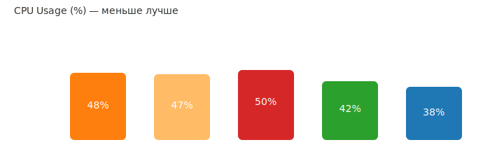

# Bun — A Fast JavaScript Runtime and Tooling Ecosystem


> **For whom this article is:** For JavaScript/TypeScript developers seeking an alternative to Node.js with improved performance, built-in tools, and a simplified workflow.

Bun is a modern JavaScript runtime and tooling suite that combines a runtime, package manager, bundler, and test runner. Bun''s primary goal is to provide developers with the fastest and simplest stack for working with JavaScript and TypeScript.

In this article, we''ll explore Bun''s key features, demonstrate performance metrics for basic scenarios (HTTP server, cold start, memory, package installation), and discuss when to use it.

## Table of Contents

- [What is Bun?](#what-is-bun)
- [Key Features](#key-features)
- [Quick Start](#quick-start)
- [Performance Metrics](#performance-metrics)
- [When to Use Bun](#when-to-use-bun)
- [Limitations and Important Considerations](#limitations-and-important-considerations)
- [Working with Multithreading](#working-with-multithreading-in-bun)
- [Links and Resources](#links-and-resources)

## What is Bun?

Bun is a project written in **Zig** and using **JavaScriptCore** (the JavaScript engine from WebKit). It positions itself as a fast replacement for Node.js and Deno, combining a package manager, bundler, transpiler, and test framework into a single binary.

**Key advantages:**

- ⚡ **Speed** — fast startup, reduced build time, and high throughput for network operations
- 📦 **Single Binary** — fewer dependencies and quick installation
- 🛠️ **Built-in Tools** — integrated package manager, bundler, and tests
- 🔄 **Compatibility** — most Node.js code can run on Bun with minimal changes

### Bun''s Creator: Jarred Sumner


**Jarred Sumner** — founder and CEO of Oven.sh, creator of Bun runtime. Graduate of the Thiel Fellowship program (2014).

**Key milestones:**

- **May 2021** — first tweets about the Bun project
- **July 5, 2022** — Bun 0.1 announcement
- **August 2022** — $7M Seed funding round from Kleiner Perkins and Guillermo Rauch (Vercel)
- **September 2023** — Bun 1.0 release
- **2025** — over 5 million downloads per month, used at Anthropic (Claude Code CLI)

Sumner actively develops the Bun ecosystem, adding new capabilities: full-stack dev server, SQL API, Redis support, and other tools for full-stack development.

**Contacts:**

- GitHub: [@Jarred-Sumner](https://github.com/Jarred-Sumner)
- X (Twitter): [@jarredsumner](https://x.com/jarredsumner)
- LinkedIn: [Jarred Sumner](https://www.linkedin.com/in/jarred-sumner-a8772425/)

### Zig Language: Bun''s Foundation


**Zig** is a modern systems programming language created by **Andrew Kelley**. Bun is written in Zig for its performance, safety, and ease of C integration.

**Why Zig was chosen for Bun:**

- 🚀 **C-like Performance** — compiles to native code without runtime overhead
- 🔒 **Memory Safety** — compile-time checks without garbage collection
- 🔄 **C Interoperability** — direct integration with C libraries (JavaScriptCore, libuv)
- ⚡ **Memory Control** — explicit management without hidden allocations
- 🛠️ **Easy Debugging** — no macros and hidden control flow

**Key Zig Features:**

- **Imperative, statically-typed** compiled language
- **No hidden control flow** — all code is explicit and predictable
- **Compile-time execution** — powerful metaprogramming system
- **Cross-compilation out of the box** — support for all popular platforms
- **Error Handling** — explicit via error types (`!` operator)

**Zig''s Creator: Andrew Kelley**


Andrew Kelley began developing Zig in 2015 with the goal of improving C by making the language simpler, safer, and more powerful.

**Recent achievements (2025):**

- Migration of the project from GitHub to Codeberg (November 2025)
- Compiler performance improvements of 5-50% for x86_64
- Development of self-hosted compiler

**Zig Philosophy:**

> "No hidden control flow. No hidden memory allocations. No preprocessor, no macros."

This makes Zig ideal for systems programming where performance and predictability are crucial.

**Links:**

- [Official Zig Website](https://ziglang.org/)
- [Andrew Kelley on GitHub](https://github.com/andrewrk)
- [Andrew Kelley''s Personal Website](https://andrewkelley.me/)

## Key Features

| Command | Description | Node.js Alternative |
|---------|----------|------------------------|
| `bun run` | Execute JavaScript/TypeScript files | `node` / `ts-node` |
| `bun install` | Fast dependency manager | `npm install` / `yarn` |
| `bun build` | Bundler and minifier | `webpack` / `esbuild` |
| `bun test` | Built-in test runner | `jest` / `vitest` |
| `bun create` | Initialize projects from templates | `npm create` |

### TypeScript: Built-in Support

Bun **natively supports** running and bundling TypeScript files without a separate compilation step — you can write `.ts`/`.tsx` directly and run it through Bun.

**Important:** Bun does NOT replace static type checking. For full type checking, use `tsc --noEmit` in CI. Bun provides a fast transpiler/bundler with support for most TypeScript syntax features and built-in sourcemaps.

## Quick Start

### Install Dependencies

```bash
bun install
```

### Run a Script

```bash
bun run start
# or directly
bun index.ts
```

### Build Your Project

```bash
bun build index.ts --target node --outfile dist/bundle.js
```

#### Watch Mode (Auto-rebuild)

```bash
# Build and watch for changes
bun build --watch --target=node --outfile=dist/server.js src/server.ts

# Disable screen clearing between rebuilds
bun build --watch --no-clear-screen --target=node --outfile=dist/server.js src/server.ts
```

**Useful Flags:**

- `--watch` — enable watch mode
- `--no-clear-screen` — don''t clear console between rebuilds
- `--outfile` / `--outdir` — build output path
- `--target` — target platform: `node`, `bun`, or `browser`
- `--react-fast-refresh` — fast refresh for React

### Run Tests

Bun includes a built-in test runner, compatible with Jest API:

```ts
// tests/example.test.ts
import { describe, it, expect } from "bun:test";

describe("sum", () => {
  it("should correctly add numbers", () => {
    const sum = (a: number, b: number) => a + b;
    expect(sum(1, 2)).toBe(3);
  });
});
```

Run tests:

```bash
# Single run
bun test

# Watch mode (restart on changes)
bun test --watch
```

Expected output:

```text
 RUNS  tests/example.test.ts
 PASS  tests/example.test.ts (5 ms)
 ✓ 1 test passed
```

## Performance Metrics

> **⚠️ Important:** Micro-benchmark results don''t always translate to real applications. In production scenarios, performance differences are often insignificant or even opposite to what synthetic tests show.

Data collected from simple HTTP server tests ("Hello World") and aggregated from independent benchmarks in 2025. Results may vary significantly in real applications with databases, complex business logic, and dependencies.

---

**Tested Versions:**

- Node.js v24.x (Active LTS, released May 6, 2025) + npm v10.9.2
- Node.js v22.x (Maintenance LTS) + npm v10.8.2
- Node.js v20.x (Maintenance LTS) + npm v10.5.0
- Deno v2.1.14 (May 13, 2025)
- Bun v1.2.17 (Jun 21, 2025)

### Cold Start (Startup Time, ms)

_Colors (left to right):_ **orange** — Node 20; **yellow** — Node 22; **red** — Node 24; **green** — Deno; **blue** — Bun.


**Results:**

- **Bun:** ~2 ms — fastest startup
- **Deno:** ~22 ms
- **Node.js v22 + npm v10.8:** ~23 ms (improved)
- **Node.js v20 + npm v10.5:** ~25 ms
- **Node.js v24 + npm v10.9:** ~26 ms (regression)

**⚠️ Important Clarification:** The displayed results (2ms for Bun) relate to micro-benchmarks in local tests. In **serverless environments** (AWS Lambda, CloudFlare Workers), Bun may show **significantly worse** results due to loading a non-standard runtime. In production use cases, cold start with Bun can increase 2-3 times.

### Throughput (Requests Per Second)


**Results:**

- **Deno 2.x:** ~68k req/s — impressive performance, exceeding Bun
- **Bun:** ~52k req/s — 4× faster than Node.js
- **Node.js v22 + npm v10.8:** ~15k req/s — improvements in WebStreams and Fetch API
- **Node.js v20/v24 + npm v10.5/v10.9:** ~13-14k req/s

**Note:** Results for a simple HTTP server without database calls. In real applications with complex logic, the difference often diminishes.

### Memory Usage (MB)


**⚠️ Important: Memory is the most contradictory metric (2025):**

Reports on Bun''s memory consumption differ significantly between synthetic benchmarks and production use cases:

**Synthetic Benchmarks (Micro):**

- **Bun:** ~40-45 MB on a simple HTTP server
- **Node.js v20/v22/v24 + npm v10.5-v10.9:** ~45-55 MB
- Difference: **minimal or in Bun''s favor**

**Production Scenarios (Real Applications, September 2025):**

- **Bun:** **Often uses +30-40% more memory**
- **Node.js:** Stable consumption, better scalability

**Reasons for Differences:**

1. **JavaScriptCore optimizes for speed** — requires more memory for JIT optimizations
2. **Dependencies and real code** — with many packages, Bun may require significantly more memory
3. **Long-lived processes** — V8 handles garbage collection better over time
4. **Micro-benchmarks are misleading** — a simple HTTP server isn''t representative of real applications

**Recommendation:** If your application is memory-sensitive (edge computing, serverless, microservices), conduct your own testing with real code before migrating to Bun.

### CPU Usage (% Load)



**Results under load (HTTP requests):**

- **Node.js v20/v22/v24 + npm v10.5-v10.9:** ~45-50% CPU — stable consumption
- **Deno 2.x:** ~42% CPU — efficient load handling
- **Bun:** ~38% CPU — better efficiency thanks to JavaScriptCore

**Key Observations:**

- **Bun shows lower CPU usage** at high throughput — JavaScriptCore is optimized for performance
- **Node.js is stable** under sustained load — V8 handles long processes better
- **Deno balances** between performance and stability

**⚠️ Important:** With real databases and business logic in production, CPU differences may be less noticeable. Testing with real code is recommended.

---

### Package Installation Speed

**Package Manager Versions:**

- npm v10.x
- yarn v4.x (Berry)
- pnpm v10.x
- bun v1.2.17 (built-in)

#### Package Manager Comparison

Package installation time by manager and scenario (in seconds, lower is better):

| Scenario | npm v10 | yarn v4 | pnpm v10 | bun v1.2 | Winner |
|----------|---------|---------|----------|----------|-------|
| **Clean install** (no cache) | 45s | 32s (-29%) | 18s (-60%) | **8s (-82%)** | 🏆 **bun** (5.6× faster) |
| **With cache** (repeat) | 22s | 15s (-32%) | 7s (-68%) | **3s (-86%)** | 🏆 **bun** (7.3× faster) |
| **CI with lockfile** (frozen) | 28s | 20s (-29%) | 12s (-57%) | **5s (-82%)** | 🏆 **bun** (5.6× faster) |
| **Update dependencies** | 35s | 26s (-26%) | 14s (-60%) | **6s (-83%)** | 🏆 **bun** (5.8× faster) |
| **Monorepo** (~50 packages) | 120s | 45s (-63%) | 25s (-79%) | **15s (-88%)** | 🏆 **bun** (8× faster) |

_Percentages show improvement relative to npm. Testing on project with ~200 dependencies._

**Key Takeaways:**

- 🥇 **Bun** — clear leader (5-8× faster than npm). Ideal for local development and CI/CD
- 🥈 **pnpm** — excellent speed and stability balance (2.5-5× faster than npm). Saves disk space
- 🥉 **yarn v4 (Berry)** — stable 25-32% improvement. Good choice for large teams
- **npm** — slowest, but most compatible. Built into Node.js

#### Comparison by Runtime

| Runtime | Built-in Manager | Clean Install | With Cache | Monorepo |
|---------|---------------------|----------|---------|----------|
| Node.js v20 | npm v10.5 | 45s | 22s | 120s |
| Node.js v22 | npm v10.8 (improved) | 42s | 19s | 110s |
| Node.js v24 | npm v10.9 | 44s | 21s | 115s |
| Deno v2.x | built-in | 38s | 16s | 95s |
| Bun v1.2 | built-in | **8s** | **3s** | **15s** |

_Node.js v22 shows modest npm improvements. Deno is 15-20% faster than Node.js+npm thanks to optimized built-in manager._

**Important Factors Affecting Performance:**

- **Internet connection speed** — critical for initial installation
- **Filesystem type** — pnpm uses symlinks (can be slower on Windows without WSL)
- **Number and size of dependencies** — affects difference between managers
- **postinstall scripts** — can negate advantages of fast managers
- **Manager version** — yarn v1 classic is 2-3× slower than v4 Berry

## When to Use Bun

✅ **Recommended for:**

- **Local Development and DX** — significant speedup in installation, testing, and building
- **CLI Tools and Scripts** — fast startup is critical
- **New Projects** with controlled number of dependencies
- **Memory-insensitive Development** (powerful dev machines, not edge-constrained)
- **Private Microservices** with full control over dependencies

⚠️ **Use with Caution (Run Benchmarks):**

- **Production HTTP Services** — verify actual memory consumption (can be +30-40% vs Node.js)
- **Serverless/Edge Functions** — cold start may be slower than Node.js, plus memory overhead
- **Applications with Many Dependencies** — memory consumption can be critical
- **Memory-constrained Systems** — check Kubernetes pod memory limits
- **Long-lived Processes** — V8 (Node.js) has better garbage collection for production

❌ **Not Recommended:**

- **Critical Systems** requiring maximum stability and maturity
- Projects with native modules or `worker_threads` (requires rewriting)
- **Production Edge/Serverless** without prior testing
- **Memory-constrained Applications** where every MB matters

## Limitations and Important Considerations

### Core Limitations

- **JavaScriptCore vs V8:** Some Node.js API behavior may differ
- **Native Modules:** High likelihood of incompatibility with `.node` / `node-gyp` addons
- **Rapid Development:** Frequent breaking changes, monitor releases closely

### Detailed Limitations Breakdown

| Area | Issue | Solution |
|------|-------|----------|
| **Native Addons** (.node / node-gyp) | High incompatibility likelihood | Replace with pure-JS alternatives or isolate in microservice |
| **worker_threads / cluster** | Not supported | Rewrite using Web Workers API |
| **Streams / HTTP** | Differences in backpressure/events | Test integrations |
| **ESM vs CJS** | Mixed CJS code may cause issues | Convert to ESM when possible |
| **CI/Deploy** | Platform-specific builds | Use Node.js fallback containers |

**Issue Likelihood:** Depends on project architecture. Clean JS/TS projects with web-oriented libraries encounter fewer problems.

## Working with Multithreading in Bun

Bun uses the **Web Worker API** (similar to browsers) instead of Node.js `worker_threads`. This makes the model compatible with web-oriented API and quite convenient for CPU-intensive tasks.

### Key Points

- Create workers with `new Worker(...)` and communicate via `postMessage`/`onmessage`
- Use `MessageChannel` for bidirectional communication
- Use Transferable objects (ArrayBuffer) for binary data transfer — fast, no copying
- Use `Bun.spawn` for process isolation

### Simple Example (Web Worker)

```js
// worker.js
self.onmessage = (e) => {
  const arr = e.data || [];
  const sum = arr.reduce((a, x) => a + x, 0);
  self.postMessage({ sum });
};
```

```js
// main.js
const worker = new Worker(new URL(''./worker.js'', import.meta.url), { type: ''module'' });
worker.onmessage = (e) => {
  console.log(''Sum from worker:'', e.data.sum);
};
worker.postMessage([1, 2, 3, 4, 5]);
```

### Transferable Objects (No Copying)

```js
// main.js
const buffer = new ArrayBuffer(1024 * 8);
const worker = new Worker(new URL(''./worker.js'', import.meta.url), { type: ''module'' });
worker.postMessage(buffer, [buffer]); // buffer transferred as transferable

// worker.js
self.onmessage = (e) => {
  const view = new Uint8Array(e.data);
  // ... heavy task without data copying
  self.postMessage({ ok: true });
};
```

### MessageChannel for Bidirectional Communication

```js
// main.js
const chan = new MessageChannel();
const worker = new Worker(new URL(''./worker.js'', import.meta.url), { type: ''module'' });
worker.postMessage({ port: chan.port2 }, [chan.port2]);
chan.port1.onmessage = (e) => console.log(''From worker:'', e.data);
chan.port1.postMessage(''ping'');

// worker.js
self.onmessage = (e) => {
  const port = e.data.port;
  port.onmessage = (ev) => port.postMessage(''pong'');
};
```

### Using Bun.spawn (Separate Process)

```js
const p = Bun.spawn({
  cmd: ["node", "worker-process.js"],
  stdout: ''pipe'',
  stdin: ''pipe''
});
p.stdin.write(JSON.stringify({data: ''hi''}));
```

### Recommendations

- **CPU Tasks:** Use Web Workers or separate processes
- **I/O Tasks:** Prefer async/event-based approaches
- **Node.js Migration:** Rewrite `worker_threads` code for Web Worker API or use conditional detection: `if (typeof Bun !== ''undefined'') ...`

## Example: Bun in AWS Lambda

Bun can run in AWS Lambda two ways:

1. **Container Image** (recommended)
2. Custom runtime

### Minimal Dockerfile

```dockerfile
FROM oven/bun:1.2.17
COPY . /app
WORKDIR /app
RUN bun install
CMD ["bun", "run", "start"]
```

**Important:** In serverless environments, cold start with Bun may be slower than Node.js due to loading a non-standard runtime.

## Links and Resources

### Official Documentation

- [Official Bun Website](https://bun.sh)
- [GitHub: oven-sh/bun](https://github.com/oven-sh/bun)
- [Official Deno Benchmarks](https://deno.com/benchmarks)
- [Node.js Performance Working Group](https://github.com/nodejs/performance)

### Current Benchmarks and Comparisons (2025)

- [Bun vs Node.js 2025: Performance Comparison Guide - Strapi](https://strapi.io/blog/bun-vs-nodejs-performance-comparison-guide)
- [Node vs Deno vs Bun: The Ultimate 2025 Performance Battle](https://junkangworld.com/blog/node-vs-deno-vs-bun-the-ultimate-2025-performance-battle)
- [Bun vs Node Memory: The Real Performance Story Behind the Hype](https://ritik-chopra28.medium.com/bun-vs-node-memory-the-real-performance-story-behind-the-hype-5f1f8ab3b3e2)
- [State of Node.js Performance 2024 - NodeSource](https://nodesource.com/blog/State-of-Nodejs-Performance-2024)

### Production-Oriented Benchmarks (Anton Putra)

One of the most comprehensive approaches to testing is the work of **Anton Putra** ([antonputra.com](https://antonputra.com)), a DevOps engineer known for deep production benchmarks:

**Performance Review Videos:**

- ["Bun vs Node.js: Performance Benchmark in Kubernetes"](https://youtu.be/EhkrlENi8i4) — detailed analysis of performance in containerized applications
- ["Go (Golang) vs. Bun: Performance"](https://youtu.be/RdOkJYvl5TA) — comparing Bun with compiled languages
- ["Deno vs. Node.js vs Bun: Performance"](https://youtu.be/x0QOTSXI_Dc) — comprehensive comparison of all three runtimes
- ["Deno vs. Node.js vs. Bun: Performance Comparison"](https://youtu.be/btm3LyY3ZVc) — updated comparison

**Key Conclusions from Putra''s Work:**

1. **Synthetic benchmarks lie** — simple HTTP tests don''t reflect real behavior with databases and network I/O
2. **Bun excels with CLI tools** — fast startup, but in production with databases this advantage is less noticeable
3. **Node.js is more stable in Kubernetes** — under sustained load, V8 shows more predictable behavior
4. **Memory and CPU throttling** — crucial factors in containerized environments where Bun may perform worse
5. **Ecosystem maturity wins** — many production-hardened libraries and patterns for Node.js provide advantages despite Bun''s novelty

### Production Use Cases and Practical Experience

- [Node vs Bun: no backend performance difference](https://evertheylen.eu/p/node-vs-bun/)
- [Investigating a Severe Performance Regression in Node.js v22 and v24](https://github.com/nodejs/node/issues/60719)
- [Deno 2.0: The Next Evolution in JavaScript Runtime](https://ikiran.vercel.app/insights/deno-2-revolutionizing-javascript-runtime)

### Testing Tools

- [GitHub: denosaurs/bench - Comparing HTTP frameworks](https://github.com/denosaurs/bench)
- [GitHub: RafaelGSS/nodejs-bench-operations](https://github.com/RafaelGSS/nodejs-bench-operations)

---

## Summary

**Bun''s Strengths:**

- ⚡ Exceptional package installation speed (5-8× faster than npm)
- 🚀 Fast application startup (cold start ~2ms in local tests)
- 📦 Built-in tools: runtime, bundler, test runner, package manager
- 🔄 TypeScript out of the box without additional setup
- 🎯 Simple usage and minimal configuration

**Weaknesses and Limitations:**

- 🧠 **Memory: Contradictory Results** — synthetic benchmarks show parity, production often shows +30-40% vs Node.js
- ⚠️ Incompatibility with some native Node.js modules
- 🔧 Requires rewriting code using `worker_threads`
- 🌩️ Slow cold start in serverless environments (AWS Lambda)
- 🔄 Rapid development with frequent breaking changes

**Application Recommendations:**

- **Local Development:** Great choice for accelerating workflow
- **New Projects:** Minimal configuration, quick start
- **CI/CD:** Significant time savings on package installation
- **Production:** Benchmark real memory consumption before migrating (real code, real load)
- **Monorepos:** Dramatic improvement in package manager performance
- **Serverless/Edge:** Requires attention to memory overhead — may be worse than Node.js

---

**Disclaimer:** The data in this article is collected from public sources and independent benchmarks. Performance depends heavily on your specific use case, application architecture, software versions, and hardware. It is recommended to conduct your own testing for your specific use scenario.

---

**Author:** Vitaly Balabanov
