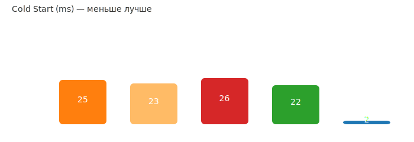
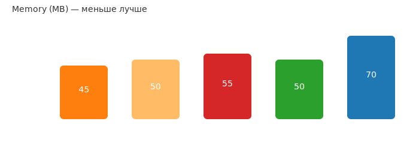

# Bun — быстрый JavaScript-рантайм и инструментальная экосистема


> **Для кого эта статья:** для разработчиков JavaScript/TypeScript, которые ищут альтернативу Node.js с улучшенной производительностью, встроенными инструментами и упрощенным рабочим процессом.

Bun — это современный JavaScript-рантайм и набор инструментов, объединяющий в себе runtime, менеджер пакетов, бандлер и тестовый раннер. Главная цель Bun — предоставить разработчикам максимально быстрый и простой стек для работы с JavaScript и TypeScript.

В этой статье рассмотрим ключевые особенности Bun, покажем метрики производительности для базовых сценариев (HTTP-сервер, cold start, память, установка пакетов) и обсудим, когда стоит его использовать.

## Оглавление

- [Что такое Bun?](#что-такое-bun)
- [Основные функции](#основные-функции)
- [Быстрый старт](#быстрый-старт)
- [Метрики производительности](#метрики-производительности)
- [Когда стоит использовать Bun](#когда-стоит-использовать-bun)
- [Ограничения и моменты внимания](#ограничения-и-моменты-внимания)
- [Работа с многопоточностью](#работа-с-многопоточностью-в-bun)
- [Ссылки и ресурсы](#ссылки-на-источники-и-дополнительные-материалы)

## Что такое Bun?

Bun — это проект, написанный на **Zig** и использующий **JavaScriptCore** (движок JavaScript от WebKit). Он позиционируется как быстрая замена Node.js и Deno, объединяя пакетный менеджер, бандлер, транспилер и тестовый фреймворк в одном бинарном файле.

**Основные преимущества:**

- ⚡ **Скорость** — быстрый старт, меньшее время сборки и высокая пропускная способность для сетевых операций
- 📦 **Единый бинарник** — меньше зависимостей и быстрая установка
- 🛠️ **Инструменты из коробки** — встроенный пакетный менеджер, бандлер и тесты
- 🔄 **Совместимость** — большинство кода для Node.js можно запускать на Bun с минимальными изменениями

### Создатель Bun: Jarred Sumner


**Jarred Sumner** — основатель и CEO компании Oven.sh, создатель Bun runtime. Выпускник программы Thiel Fellowship (2014).

**Ключевые вехи:**

- **Май 2021** — первые твиты о проекте Bun
- **5 июля 2022** — анонс Bun 0.1
- **Август 2022** — раунд финансирования $7M (Seed) от Kleiner Perkins и Guillermo Rauch (Vercel)
- **Сентябрь 2023** — релиз Bun 1.0
- **2025** — более 5 миллионов загрузок в месяц, используется в Anthropic (Claude Code CLI)

Sumner активно развивает экосистему Bun, добавляя новые возможности: full-stack dev server, SQL API, Redis support и другие инструменты для фулл-стек разработки.

**Контакты:**

- GitHub: [@Jarred-Sumner](https://github.com/Jarred-Sumner)
- X (Twitter): [@jarredsumner](https://x.com/jarredsumner)
- LinkedIn: [Jarred Sumner](https://www.linkedin.com/in/jarred-sumner-a8772425/)

### Язык Zig: фундамент Bun


**Zig** — современный системный язык программирования, созданный **Andrew Kelley**. Bun написан на Zig благодаря его производительности, безопасности и простоте интеграции с C.

**Почему Zig выбран для Bun:**

- 🚀 **Производительность как у C** — компилируется в нативный код без runtime overhead
- 🔒 **Безопасность памяти** — проверки на compile-time без garbage collector
- 🔄 **Совместимость с C** — прямая интеграция с C-библиотеками (JavaScriptCore, libuv)
- ⚡ **Контроль над памятью** — явное управление без скрытых аллокаций
- 🛠️ **Простота отладки** — отсутствие макросов и скрытого control flow

**Ключевые особенности Zig:**

- **Императивный, статически типизированный** компилируемый язык
- **Нет скрытого control flow** — весь код явный и предсказуемый
- **Compile-time выполнение** — мощная система метапрограммирования
- **Кросс-компиляция из коробки** — поддержка всех популярных платформ
- **Обработка ошибок** — явная через типы ошибок (`!` оператор)

**Создатель Zig: Andrew Kelley**


Andrew Kelley начал разработку Zig в 2015 году с целью улучшить C, сделав язык проще, безопаснее и мощнее.

**Последние достижения (2025):**

- Миграция проекта с GitHub на Codeberg (ноябрь 2025)
- Улучшение производительности компилятора на 5-50% для x86_64
- Развитие self-hosted компилятора

**Философия Zig:**

> "No hidden control flow. No hidden memory allocations. No preprocessor, no macros."

Это делает Zig идеальным выбором для системного программирования, где важны производительность и предсказуемость.

**Ссылки:**

- [Официальный сайт Zig](https://ziglang.org/)
- [Andrew Kelley на GitHub](https://github.com/andrewrk)
- [Личный сайт Andrew Kelley](https://andrewkelley.me/)

## Основные функции

| Команда | Описание | Альтернатива в Node.js |
|---------|----------|------------------------|
| `bun run` | Выполнение JavaScript/TypeScript файлов | `node` / `ts-node` |
| `bun install` | Быстрый менеджер зависимостей | `npm install` / `yarn` |
| `bun build` | Бандлер и минификатор | `webpack` / `esbuild` |
| `bun test` | Встроенный тест-раннер | `jest` / `vitest` |
| `bun create` | Инициализация проектов из шаблонов | `npm create` |

### TypeScript: встроенная поддержка

Bun **изначально поддерживает** запуск и бандлинг TypeScript файлов без отдельного этапа компиляции — вы можете писать `.ts`/`.tsx` напрямую и запускать через Bun.

**Важно:** Bun НЕ заменяет статическую проверку типов. Для полноценной проверки типов рекомендуется использовать `tsc --noEmit` в CI. Bun предоставляет быстрый транспилятор/бандлер с поддержкой большинства синтаксических возможностей TypeScript и встроенными sourcemaps.

## Быстрый старт

### Установка зависимостей

```bash
bun install
```

### Запуск скрипта

```bash
bun run start
# или напрямую
bun index.ts
```

### Сборка проекта

```bash
bun build index.ts --target node --outfile dist/bundle.js
```

#### Режим watch (автоматическая пересборка)

```bash
# Собрать и наблюдать за изменениями
bun build --watch --target=node --outfile=dist/server.js src/server.ts

# Отключить очистку экрана между пересборками
bun build --watch --no-clear-screen --target=node --outfile=dist/server.js src/server.ts
```

**Полезные флаги:**
- `--watch` — включить режим наблюдения
- `--no-clear-screen` — не очищать консоль между пересборками
- `--outfile` / `--outdir` — путь к результату сборки
- `--target` — целевая платформа: `node`, `bun` или `browser`
- `--react-fast-refresh` — быстрая перезагрузка для React

### Запуск тестов

Bun включает встроенный тест-раннер, совместимый с Jest API:

```ts
// tests/example.test.ts
import { describe, it, expect } from "bun:test";

describe("sum", () => {
  it("должен корректно складывать числа", () => {
    const sum = (a: number, b: number) => a + b;
    expect(sum(1, 2)).toBe(3);
  });
});
```

Запуск тестов:

```bash
# Однократный запуск
bun test

# Режим watch (перезапуск при изменениях)
bun test --watch
```

Ожидаемый вывод:

```text
 RUNS  tests/example.test.ts
 PASS  tests/example.test.ts (5 ms)
 ✓ 1 test passed
```

## Метрики производительности

> **⚠️ Важно:** Результаты микро-бенчмарков не всегда переносятся на реальные приложения. В production-сценариях разница в производительности часто незначительна или даже противоположна заявленной в синтетических тестах.

Данные получены из простых HTTP-сервера тестов ("Hello World") и агрегированы из независимых бенчмарков 2025 года. Результаты могут значительно отличаться в реальных приложениях с базами данных, сложной бизнес-логикой и зависимостями.

---

**Тестовые версии:**

- Node.js v24.x (Active LTS, released May 6, 2025)
- Node.js v22.x (Maintenance LTS)
- Node.js v20.x (Maintenance LTS)
- Deno v2.1.14 (May 13, 2025)
- Bun v1.2.17 (Jun 21, 2025)

### Cold Start (время запуска, мс)

_Цвета (слева направо):_ **оранжевый** — Node 20; **жёлтый** — Node 22; **красный** — Node 24; **зелёный** — Deno; **синий** — Bun.



**Результаты:**

- **Bun:** ~2 ms — самый быстрый запуск
- **Deno:** ~22 ms
- **Node.js v22:** ~23 ms (улучшение)
- **Node.js v20:** ~25 ms
- **Node.js v24:** ~26 ms (регрессия)

**⚠️ Важное уточнение:** Показанные результаты (2ms для Bun) относятся к микро-бенчмаркам локального запуска. В **serverless-окружениях** (AWS Lambda, CloudFlare Workers) Bun может показывать **значительно худшие** результаты из-за необходимости загрузки нестандартного runtime. В production-кейсах cold start с Bun может увеличиться в 2-3 раза.

### Throughput (пропускная способность, req/s)


**Результаты:**

- **Deno 2.x:** ~68k req/s — впечатляющая производительность, превосходящая Bun
- **Bun:** ~52k req/s — в 4× быстрее Node.js
- **Node.js v22:** ~15k req/s — улучшения в WebStreams и Fetch API
- **Node.js v20/v24:** ~13-14k req/s

**Примечание:** Результаты для простого HTTP-сервера без обращений к базе данных. В реальных приложениях с комплексной логикой разница часто сглаживается.

### Memory Usage (потребление памяти, MB)



**⚠️ Важно:** Вопреки популярному мнению, Bun использует **больше памяти**, чем Node.js:

- **Bun:** ~70 MB
- **Node.js v20/v22/v24:** ~45-55 MB
- **Deno:** ~50 MB

В production-кейсах отмечалось увеличение потребления памяти на **30-40%** при миграции с Node.js на Bun. Это связано с архитектурой JavaScriptCore и оптимизациями под скорость выполнения.

---

### Установка зависимостей

**Версии менеджеров пакетов:**

- npm v10.x
- yarn v4.x (Berry)
- pnpm v10.x
- bun v1.2.17 (встроенный)

#### Сравнение менеджеров пакетов

Время установки пакетов в зависимости от менеджера и сценария (в секундах, меньше — лучше):

| Сценарий | npm v10 | yarn v4 | pnpm v10 | bun v1.2 | Лидер |
|----------|---------|---------|----------|----------|-------|
| **Чистая установка** (без кэша) | 45s | 32s (-29%) | 18s (-60%) | **8s (-82%)** | 🏆 **bun** (5.6× быстрее) |
| **С кэшем** (повторная) | 22s | 15s (-32%) | 7s (-68%) | **3s (-86%)** | 🏆 **bun** (7.3× быстрее) |
| **CI с lockfile** (frozen) | 28s | 20s (-29%) | 12s (-57%) | **5s (-82%)** | 🏆 **bun** (5.6× быстрее) |
| **Обновление зависимостей** | 35s | 26s (-26%) | 14s (-60%) | **6s (-83%)** | 🏆 **bun** (5.8× быстрее) |
| **Монорепо** (~50 пакетов) | 120s | 45s (-63%) | 25s (-79%) | **15s (-88%)** | 🏆 **bun** (8× быстрее) |

_Проценты показывают улучшение относительно npm. Тестирование на проекте с ~200 зависимостями._

**Ключевые выводы:**

- 🥇 **Bun** — безусловный лидер (в 5-8 раз быстрее npm). Идеален для локальной разработки и CI/CD
- 🥈 **pnpm** — отличный баланс скорости и стабильности (в 2.5-5 раз быстрее npm). Экономит дисковое пространство
- 🥉 **yarn v4 (Berry)** — стабильное улучшение на 25-32%. Хороший выбор для больших команд
- **npm** — самый медленный, но наиболее совместимый. Встроен в Node.js

#### Сравнение по runtime

| Runtime | Встроенный менеджер | Чистая установка | С кэшем | Монорепо |
|---------|---------------------|------------------|---------|----------|
| Node.js v20 | npm | 45s | 22s | 120s |
| Node.js v22 | npm (улучш.) | 42s | 19s | 110s |
| Node.js v24 | npm | 44s | 21s | 115s |
| Deno v2.x | встроенный | 38s | 16s | 95s |
| Bun v1.2 | встроенный | **8s** | **3s** | **15s** |

_Node.js v22 показывает небольшое улучшение npm. Deno на 15-20% быстрее Node.js+npm благодаря оптимизированному встроенному менеджеру._

**Важные факторы, влияющие на производительность:**

- **Скорость интернет-соединения** — критична для первой установки
- **Тип файловой системы** — pnpm использует symlinks (может быть медленнее на Windows без WSL)
- **Количество и размер зависимостей** — влияет на разницу между менеджерами
- **postinstall скрипты** — могут нивелировать преимущества быстрых менеджеров
- **Версия менеджера** — yarn v1 classic в 2-3 раза медленнее v4 Berry

---

## Bun vs Deno: сравнение подходов

И Bun, и Deno — современные альтернативы Node.js, но они решают разные задачи и имеют различную философию. Вот объективное сравнение:

### Где Bun превосходит Deno

#### 🚀 Совместимость с npm-экосистемой

**Bun:**
- ✅ **90%+ совместимость** с npm-пакетами из коробки
- ✅ Полная поддержка `package.json` и `node_modules`
- ✅ Встроенный менеджер пакетов **в 5-8 раз быстрее** npm
- ✅ Бинарный lockfile (`bun.lockb`) для мгновенной установки

**Deno:**
- ⚠️ **80%+ совместимость** через npm specifiers (улучшено в Deno 2.0)
- ⚠️ Поддержка npm — относительно новая функция с edge cases
- ⚠️ Собственная экосистема (deno.land/x) значительно меньше npm

**Вывод:** Для проектов с большим количеством npm-зависимостей Bun — более практичный выбор.

#### ⚡ Скорость установки пакетов

| Сценарий | Bun | Deno | Преимущество Bun |
|----------|-----|------|------------------|
| Чистая установка | 8s | 38s | **4.8× быстрее** |
| С кэшем | 3s | 16s | **5.3× быстрее** |
| Монорепо | 15s | 95s | **6.3× быстрее** |

#### 🛠️ Developer Experience для миграции с Node.js

- **Bun:** Drop-in замена для Node.js — большинство проектов работают без изменений
- **Deno:** Требует переосмысления архитектуры (URL imports, permissions)

### Где Deno превосходит Bun

#### 🔒 Безопасность

**Deno:**
- ✅ **Permissions system** — явные флаги для доступа (--allow-net, --allow-read)
- ✅ Написан на **Rust** — гарантии безопасности памяти
- ✅ Подходит для запуска недоверенного кода в sandbox

**Bun:**
- ❌ Пока нет системы разрешений (как в Node.js)
- ⚠️ Не рекомендуется для изолированного выполнения кода

**Вывод:** Для security-critical приложений и edge deployments Deno — лучший выбор.

#### 🏆 Производительность HTTP (throughput)

Как показали бенчмарки:

- **Deno 2.x:** ~68k req/s
- **Bun:** ~52k req/s

Deno показывает **на 30% выше throughput** в HTTP-нагрузках.

#### 🧰 Встроенные инструменты

**Deno:**
- ✅ REPL для экспериментов
- ✅ Встроенный linter и formatter
- ✅ Test runner
- ✅ Debugger
- ✅ Простое создание исполняемых файлов

**Bun:**
- ✅ Test runner, bundler
- ❌ Нет REPL
- ❌ Нет встроенного linter/formatter

#### 🌐 Web Standards

**Deno:**
- ✅ Полная совместимость с Web Platform APIs (fetch, WebSocket, Web Crypto)
- ✅ Код работает идентично в браузере и на сервере

**Bun:**
- ⚠️ Частичная совместимость с Web APIs
- ⚠️ Использует JavaScriptCore вместо V8

### 📊 Сравнительная таблица

| Критерий | Bun | Deno | Победитель |
|----------|-----|------|------------|
| **npm-совместимость** | 90%+ | 80%+ | 🏆 **Bun** |
| **Скорость установки пакетов** | Очень быстрая | Средняя | 🏆 **Bun** |
| **Throughput (HTTP)** | 52k req/s | 68k req/s | 🏆 **Deno** |
| **Cold start** | ~2ms | ~22ms | 🏆 **Bun** |
| **Безопасность** | Нет permissions | Permissions system | 🏆 **Deno** |
| **Встроенные инструменты** | Базовые | Полные | 🏆 **Deno** |
| **TypeScript** | Встроенный | Встроенный | 🤝 Равны |
| **Миграция с Node.js** | Простая | Сложная | 🏆 **Bun** |
| **Web Standards** | Частичная | Полная | 🏆 **Deno** |
| **Размер экосистемы** | npm (2M+) | deno.land/x (меньше) | 🏆 **Bun** |

### 🎯 Когда выбирать Bun вместо Deno

**Выбирайте Bun, если:**

- 📦 Вам нужна **максимальная совместимость с npm** (90%+)
- ⚡ Критична **скорость установки зависимостей** (CI/CD, монорепо)
- 🔄 Вы **мигрируете с Node.js** и хотите минимум изменений
- 🚀 Приоритет — **быстрый cold start** для CLI-инструментов
- 💼 У вас существующий Node.js проект с множеством зависимостей

**Выбирайте Deno, если:**

- 🔒 Нужна **безопасность и изоляция** (permissions system)
- 🌐 Важна **полная совместимость с Web Standards**
- 🏆 Критична **максимальная производительность HTTP** (edge functions)
- 🧰 Вы цените **богатый набор встроенных инструментов**
- 🆕 Начинаете новый проект с нуля без legacy-кода

### 💡 Практический совет

Для большинства разработчиков, работающих с Node.js-экосистемой:

- **Bun** — оптимальный выбор для **ускорения разработки** и **локальной работы**
- **Deno** — предпочтителен для **новых проектов** с фокусом на **безопасность** и **современные стандарты**

Оба runtime активно развиваются, и разрыв в возможностях постепенно сокращается.

---

## Когда стоит использовать Bun

✅ **Рекомендуется использовать:**

- Разработка новых проектов с упором на скорость разработки
- Локальная разработка и CI/CD — ускорение установки зависимостей и сборки
- Небольшие HTTP-сервисы и API с минимальными зависимостями
- Скрипты и утилиты, где важна скорость запуска
- Проекты на чистом JavaScript/TypeScript без нативных аддонов

⚠️ **Используйте с осторожностью:**

- Production-приложения с критичными требованиями к стабильности
- Проекты с большим количеством нативных зависимостей (node-gyp, .node модули)
- Serverless Functions (AWS Lambda) — холодный старт может быть медленнее Node.js
- Legacy-проекты с зависимостью от Node.js специфичных API

❌ **Не рекомендуется:**

- Проекты, использующие `worker_threads`, `cluster` (требуется переписывание)
- Приложения с нативными модулями, несовместимыми с JavaScriptCore
- Критичные системы, где требуется максимальная стабильность и зрелость экосистемы

## Ограничения и моменты внимания

### Основные ограничения

- **JavaScriptCore vs V8:** Поведение некоторых Node.js API может отличаться
- **Нативные модули:** Высокая вероятность несовместимости с `.node` / `node-gyp` аддонами
- **Стремительное развитие:** Частые breaking changes, следите за релизами

### Детальная выжимка ограничений

| Область | Проблема | Решение |
|---------|----------|---------|
| **Нативные аддоны** (.node / node-gyp) | Высокая вероятность несовместимости | Замените на pure-JS альтернативы или изолируйте в микросервис |
| **worker_threads / cluster** | Не поддерживаются | Переписывайте под Web Workers API |
| **Streams / HTTP** | Различия в backpressure/событиях | Тестируйте интеграции |
| **ESM vs CJS** | Смешанный CJS код может вызвать проблемы | Конвертируйте в ESM при возможности |
| **CI/Deploy** | Специфичные сборки | Используйте fallback-контейнеры с Node |

**Вероятность проблем:** Зависит от архитектуры проекта. Чистые JS/TS проекты с web-ориентированными библиотеками сталкиваются с проблемами реже.

## Работа с многопоточностью в Bun

Bun использует **Web Worker API** (аналогично браузерам), а не Node.js `worker_threads`. Это делает модель совместимой с web-ориентированным API и достаточно удобной для CPU-интенсивных задач.

### Ключевые моменты

- Создаёте воркер с `new Worker(...)` и общаетесь через `postMessage`/`onmessage`
- Используйте `MessageChannel` для двунаправленной связи
- Для передачи бинарных данных применяйте Transferable-объекты (ArrayBuffer) — быстро, без копирования
- Для изоляции процессов используйте `Bun.spawn`

### Простой пример (Web Worker)

```js
// worker.js
self.onmessage = (e) => {
  const arr = e.data || [];
  const sum = arr.reduce((a, x) => a + x, 0);
  self.postMessage({ sum });
};
```

```js
// main.js
const worker = new Worker(new URL('./worker.js', import.meta.url), { type: 'module' });
worker.onmessage = (e) => {
  console.log('Sum from worker:', e.data.sum);
};
worker.postMessage([1, 2, 3, 4, 5]);
```

### Transferable объекты (без копирования)

```js
// main.js
const buffer = new ArrayBuffer(1024 * 8);
const worker = new Worker(new URL('./worker.js', import.meta.url), { type: 'module' });
worker.postMessage(buffer, [buffer]); // buffer передаётся как transferable

// worker.js
self.onmessage = (e) => {
  const view = new Uint8Array(e.data);
  // ... heavy task без копирования данных
  self.postMessage({ ok: true });
};
```

### MessageChannel для двунаправленной связи

```js
// main.js
const chan = new MessageChannel();
const worker = new Worker(new URL('./worker.js', import.meta.url), { type: 'module' });
worker.postMessage({ port: chan.port2 }, [chan.port2]);
chan.port1.onmessage = (e) => console.log('From worker:', e.data);
chan.port1.postMessage('ping');

// worker.js
self.onmessage = (e) => {
  const port = e.data.port;
  port.onmessage = (ev) => port.postMessage('pong');
};
```

### Использование Bun.spawn (отдельный процесс)

```js
const p = Bun.spawn({
  cmd: ["node", "worker-process.js"],
  stdout: 'pipe',
  stdin: 'pipe'
});
p.stdin.write(JSON.stringify({data: 'hi'}));
```

### Рекомендации

- **CPU-задачи:** Используйте Web Workers или отдельные процессы
- **IO-задачи:** Предпочтительнее асинхронные/event-based подходы
- **Миграция с Node.js:** Переписывайте `worker_threads` код под Web Worker API или используйте условную детекцию: `if (typeof Bun !== 'undefined') ...`

## Пример: Bun в AWS Lambda

Bun можно запускать в AWS Lambda двумя способами:

1. **Контейнерный образ** (рекомендуется)
2. Custom runtime

### Минимальный Dockerfile

```dockerfile
FROM oven/bun:1.2.17
COPY . /app
WORKDIR /app
RUN bun install
CMD ["bun", "run", "start"]
```

**Важно:** В serverless-окружениях cold start с Bun может быть медленнее Node.js из-за загрузки нестандартного runtime.

## Ссылки на источники и дополнительные материалы

### Официальная документация

- [Официальный сайт Bun](https://bun.sh)
- [GitHub: oven-sh/bun](https://github.com/oven-sh/bun)
- [Официальные бенчмарки Deno](https://deno.com/benchmarks)
- [Node.js Performance Working Group](https://github.com/nodejs/performance)

### Актуальные бенчмарки и сравнения (2025)

- [Bun vs Node.js 2025: Performance Comparison Guide - Strapi](https://strapi.io/blog/bun-vs-nodejs-performance-comparison-guide)
- [Node vs Deno vs Bun: The Ultimate 2025 Performance Battle](https://junkangworld.com/blog/node-vs-deno-vs-bun-the-ultimate-2025-performance-battle)
- [Bun vs Node Memory: The Real Performance Story Behind the Hype](https://ritik-chopra28.medium.com/bun-vs-node-memory-the-real-performance-story-behind-the-hype-5f1f8ab3b3e2)
- [State of Node.js Performance 2024 - NodeSource](https://nodesource.com/blog/State-of-Nodejs-Performance-2024)

### Производственные кейсы и практический опыт

- [Node vs Bun: no backend performance difference](https://evertheylen.eu/p/node-vs-bun/)
- [Investigating a Severe Performance Regression in Node.js v22 and v24](https://github.com/nodejs/node/issues/60719)
- [Deno 2.0: The Next Evolution in JavaScript Runtime](https://ikiran.vercel.app/insights/deno-2-revolutionizing-javascript-runtime)

### Инструменты для тестирования

- [GitHub: denosaurs/bench - Comparing HTTP frameworks](https://github.com/denosaurs/bench)
- [GitHub: RafaelGSS/nodejs-bench-operations](https://github.com/RafaelGSS/nodejs-bench-operations)

---

## Итоги

**Сильные стороны Bun:**

- ⚡ Исключительная скорость установки пакетов (в 5-8 раз быстрее npm)
- 🚀 Быстрый запуск приложений (cold start ~2ms в локальных тестах)
- 📦 Встроенные инструменты: runtime, bundler, test runner, package manager
- 🔄 TypeScript из коробки без дополнительной настройки
- 🎯 Простота использования и минимальная конфигурация

**Слабые стороны и ограничения:**

- 🧠 Повышенное потребление памяти (+30-40% по сравнению с Node.js)
- ⚠️ Несовместимость с некоторыми нативными Node.js модулями
- 🔧 Требует переписывания кода, использующего `worker_threads`
- 🌩️ Медленный cold start в serverless-окружениях (AWS Lambda)
- 🔄 Быстрое развитие с частыми breaking changes

**Рекомендации по применению:**

- **Новые проекты:** Отличный выбор для быстрого старта
- **Локальная разработка:** Существенное ускорение сборки и установки
- **CI/CD:** Значительная экономия времени на установке зависимостей
- **Production:** Используйте осторожно, тщательно тестируйте перед миграцией
- **Монорепозитории:** Драматическое улучшение скорости работы с пакетами

---

**Отказ от ответственности:** Данные в этой статье собраны из публичных источников и независимых бенчмарков. Производительность сильно зависит от конкретного use-case, архитектуры приложения, версий ПО и аппаратного обеспечения. Рекомендуется проводить собственное тестирование для вашего конкретного сценария использования.

---

**Автор-составитель:** Виталий Балабанов
