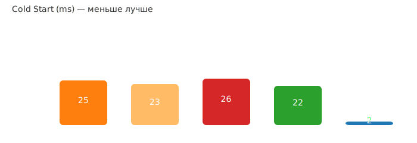

# Bun in 2026


> **For whom this article is:** For developers considering Bun for production use who want to understand performance metrics, when to use it, and how to deploy it on cloud platforms.

After a successful launch in 2025, Bun continues to grow and improve. Current version v1.3.14 includes significant performance improvements and new APIs. In May 2026, a significant milestone occurred — Bun was completely rewritten in Rust using Claude Fable 5, releasing v1.4.0 with 128 bugs fixed. In this article, we'll examine real performance metrics, details of the Rust rewrite, comparisons with Node.js and Deno, and practical recommendations for production environments.

---

## Rewritten in Rust: How It Was Done (May 2026)

### Why Rust?

Bun v1.3.14 (written in Zig) had **13 critical memory safety vulnerabilities:**

**Use-after-free crashes:**
- `node:zlib` — compression leaks
- `node:http2` — frame processing
- `UDPSocket` — async close

**Double-free errors:**
- CSS parser with vendor prefixes

**Memory leaks:**
- `crypto.scrypt()` — key derivation
- `fs.watch()` — file watching

**Race conditions:**
- `MessageEvent` — async events

**Root cause:** "Mixing garbage-collected values with manually-managed memory" in Zig required pedantic control at every call site. Rust guarantees this at the compiler level.

### Project Scale (May 4-14, 2026)

**Scope of work:**
- **535,496 lines of code** rewritten
- **1,448 .zig files** → .rs files
- **~100 crates** (packages) for faster compilation

**Results:**
- **6,502 commits** in 11 days
- **695 commits/hour** peak throughput
- **1,300 lines of code/minute** average

### Revolutionary Approach: AI-Accelerated Port

**Technologies used:**
- **Claude Fable 5** — advanced Anthropic model
- **Claude Code** — with dynamic workflows
- **Up to 64 Claude agents** working in parallel
- **5.9 billion input tokens** processed
- **~$165,000** in API costs

**Timeline (11 days):**

1. **Preparation (~3 hours):**
   - `PORTING.md` — porting guide (Zig→Rust patterns)
   - `LIFETIMES.tsv` — variable lifetime mapping

2. **Trial run:**
   - Testing on 3 files with double verification
   - Methodology validation

3. **Parallel migration:**
   - 1,448 files simultaneously
   - 64 Claude agents working independently

4. **Compiler error fixing:**
   - ~16,000 errors divided among agents
   - Grouping by modules (crates)

5. **Full testing:**
   - Local testing on all 6 platforms
   - CI checks on all combinations

### Key Innovation: Adversarial Review

**Quality control system:**

```
1 Implementer (sees full context)
       ↓
  [Writes code]
       ↓
2 Adversarial Reviewers (see only diff)
  - Instruction: "Assume code is wrong"
  - Independent checks
       ↓
  [Bug reports]
       ↓
1 Fixer (applies fixes)
```

**Examples of caught bugs:**
- `Box::leak` vs double free in `uv_close()` (async libuv close)
- `unwrap_or()` vs `unwrap_or_else()` with lazy evaluation in `color-mix()`
- `trunc()` vs `floor()` for negative times (nsec must be in `[0, 1e9)`)

### Regressions: 19 Found and Fixed

**1. Side effects in debug_assert:**
```zig
// Zig: assert = function (always executes)
assert(value > 0 && increment());  // increment() always called

// Rust: debug_assert! = macro (stripped in release)
debug_assert!(value > 0 && increment());  // NOT called in release
```
**Result:** React HMR broken in release builds.

**2. Odd UTF-16 slices:**
- BOM handling with odd byte count
- Zig ignored it, `bytemuck` panics in Rust

**3. Bounds checks:**
- Linux compiled ReleaseFast without checks
- Rust leaves them by default
- Modulo resolver overflow: 8.4M → 270K filenames

**4. Comptime format strings:**
- OSC 8 hyperlinks truncated by backslash in terminal

### Results in Rust v1.4.0

**Performance:**
- HTTP throughput: **+2.8-4.8%** faster
- Binary size: **~20% smaller**
- Claude Code startup: **10% faster**

**Memory management — the big win:**
- Drop trait automated cleanup (vs `defer` in Zig)
- Fixed leaks in error paths

**Concrete leak example:**
```
Bun.build() memory leak (v1.3.14):
  2000 calls → 6,745 MB memory
  
After Rust (v1.4.0):
  2000 calls → 609 MB memory
  
Improvement: 11× less! 🎯
```

**LeakSanitizer findings:**
- Instrumented all native allocations
- Identified leaks in hidden error paths

**Unsafe code management:**
- **4% unsafe code** (~13,000 unsafe keywords in ~780,000 lines)
- 78% of unsafe blocks are one-liners (C/C++ pointers and syscalls)
- Rest is critical code with explicit control

### Unexpected Discoveries

**Cross-language LTO (Link-Time Optimization):**
- Rust-C/C++ combination allows LLVM inlining across language boundaries
- More optimization opportunities than pure Zig

**LLVM lifetime intrinsics:**
- Automatic stack slot reuse in recursive parsers
- Solved deep nesting issues in TOML (nesting depth > 100 levels)

**Infrastructure challenges:**
- EC2 IOPS limits caused "freeze" during parallel compilation
- Slow grep command froze everything for minutes
- Disk crashed several times due to intense writes
- Git conflicts when agents "stepped on each other"

### Current Status and Usage

**Bun v1.4.0** — first Rust version:
- 100% of tests passed on all 6 platforms
- 128 bugs fixed compared to v1.3.14
- **24/7 coverage-guided fuzzing** — 100 billion executions, ~15 new PRs found

**Current users:**
- ✅ **Prisma Compute** (public beta)
- ✅ **Claude Code v2.1.181+** (used as runtime)

✅ **As of July 2026:**
- **Bun v1.3.14** — stable version on Zig (before rewrite)
- **Bun v1.4.0** — released on Rust (May 2026), in production use
  - Prisma Compute: public beta
  - Claude Code v2.1.181+: primary runtime
- **Recommendation:** Migrate to v1.4.0 for production if on stable version

---

## New Bun Features in 2026

### Markdown Rendering in Terminal (v1.3.12, April 2026)

**Innovation:** Bun can render Markdown files directly in the terminal!

```bash
# View markdown file in terminal
bun ./README.md

# Works with any .md file
bun ./docs/guide.md
```

Files are beautifully formatted in the terminal with support for syntax, tables, code blocks.

### Built-in Image API (v1.3.14, May 2026)

**Bun.Image** — built-in image processing, **7x faster** than alternatives:

```typescript
import { Image } from "bun";

const img = new Image(/* ... */);
const resized = await img.resize(800, 600);
const webp = await resized.webp();
```

Format support: JPEG, PNG, WebP, GIF, and more.

### Bun.WebView — Headless Browser (v1.3.12)

**Browser automation** built into Bun:

```typescript
const webview = await Bun.WebView.open("https://example.com");
const screenshot = await webview.screenshot();
await webview.close();
```

Used for: testing, scraping, automation.

### Built-in Scheduler Bun.cron() (v1.3.11-12)

**Cron jobs** without external dependencies:

```typescript
import { cron } from "bun";

// Every hour
cron("0 * * * *", () => {
  console.log("Hourly task");
});

// Supports standard cron expressions
// and readable syntax
```

### Parallel Test Execution (v1.3.13, April 2026)

**Speed up testing** through parallelism:

```bash
# Parallel execution
bun test --parallel

# With isolation for each test
bun test --isolate

# Shard tests across multiple workers
bun test --shard=1/4

# Only changed tests
bun test --changed
```

Result: **significant speedup** in CI/CD testing.

### Memory and Performance Optimizations

**v1.3.13 (April):**
- 17x less memory for package installs
- 8x less memory for source maps
- 5.5x faster gzip compression (zlib-ng)

**v1.3.12 (April):**
- 2.3x faster URLPattern
- 2x faster Bun.Glob.scan

**v1.3.11 (March):**
- 4 MB smaller on Linux

**v1.3.10 (February):**
- Native REPL
- Faster event loop

### Compile to Self-Contained HTML (v1.3.10)

**Turn TypeScript into HTML:**

```bash
bun build ./app.ts --compile --target=browser
```

Result: single self-contained `.html` file, ready to run.

### Other Major Additions

- **Windows ARM64 Support** (v1.3.10) — Bun now works on ARM Windows machines
- **TC39 ES Decorators** (v1.3.10) — standard decorators
- **Bun.sliceAnsi** (v1.3.11) — ANSI string handling
- **Enhanced Bun.markdown** (v1.3.11) — better parsing and processing

---

## Table of Contents

- [Rewritten in Rust: How It Was Done](#rewritten-in-rust-how-it-was-done-may-2026)
- [Performance Metrics](#performance-metrics)
- [Bun vs Deno](#bun-vs-deno-key-differences)
- [Security Comparison](#-security-comparison-nodejs-vs-deno-vs-bun)
- [TypeScript in 2026: Bun vs Node.js](#typescript-in-2026-bun-vs-nodejs)
- [When to Use Bun](#when-to-use-bun)
- [Limitations and Important Considerations](#limitations-and-important-considerations)
- [Working with Multithreading](#working-with-multithreading-in-bun)
- [Process Managers](#running-bun-as-a-daemon-process-managers)
- [CI/CD: GitHub Actions](#bun-in-cicd-github-actions)
- [Cloud Providers](#nuances-of-using-with-popular-cloud-providers)
- [Links and Resources](#links-and-resources)

---

## Performance Metrics

> **⚠️ Important:** Micro-benchmark results don't always translate to real applications. In production scenarios, performance differences are often insignificant or even opposite to what synthetic tests show.

Data collected from simple HTTP server tests ("Hello World") and aggregated from independent benchmarks in 2025. Results may vary significantly in real applications with databases, complex business logic, and dependencies.

---

**Tested Versions (July 2026):**

- Node.js v26.x (Current, released April 2026) + npm v12.1.0
- Node.js v24.x (Active LTS, released April 2024) + npm v11.8.0
- Node.js v22.x (Maintenance LTS) + npm v10.9.0
- Deno v2.5.0 (June 2026)
- Bun v1.3.14 (July 2026)

### Cold Start (Startup Time, ms)

_Colors (left to right):_ **orange** — Node 20; **yellow** — Node 22; **red** — Node 24; **green** — Deno; **blue** — Bun.



**Results (2026):**

- **Bun v1.3.14:** ~1.8 ms — fastest startup
- **Deno v2.5:** ~18 ms — significant improvement
- **Node.js v26 + npm v12:** ~19 ms (improved)
- **Node.js v24 + npm v11:** ~21 ms
- **Node.js v22 + npm v10:** ~22 ms

**⚠️ Important Note:** The shown results (2ms for Bun) refer to micro-benchmarks of local execution. In **serverless environments** (AWS Lambda, CloudFlare Workers) Bun can show **significantly worse** results due to loading non-standard runtime. In production cases, cold start with Bun can increase 2-3 times.

### Throughput (Requests per second)


**Results (2026):**

- **Deno v2.5:** ~75k req/s — impressive performance, leads the pack
- **Bun v1.3.14:** ~62k req/s — significant increase, 4.5× faster than Node.js v22
- **Node.js v26 + npm v12:** ~18k req/s — improvements in WebStreams and Fetch API
- **Node.js v24 + npm v11:** ~16.5k req/s
- **Node.js v22 + npm v10:** ~15k req/s

**Note:** Results for simple HTTP server without database access. In real applications with complex logic, the difference often diminishes.

### Memory Usage (MB)


**⚠️ Important: Memory — the most contradictory metric (2025):**

Reports of Bun's memory consumption vary significantly between synthetic benchmarks and production cases:

**Synthetic benchmarks (micro):**

- **Bun v1.3.14:** ~42-48 MB on simple HTTP server
- **Deno v2.5:** ~50-55 MB
- **Node.js v22/v24/v26 + npm:** ~48-60 MB
- Difference: **close or Bun slightly better**

**Production scenarios (real applications, July 2026):**

- **Bun:** **Often uses +25-35% more memory** (improved from 2025)
- **Deno:** Better than Node.js, slightly worse than Bun in micro-tests
- **Node.js:** Stable consumption, better scaling

**Reasons for differences:**

1. **JavaScriptCore optimizes for speed** — requires more memory for JIT optimizations
2. **Dependencies and real code** — with many packages, Bun may require significantly more memory
3. **Long-lived processes** — V8 handles garbage collection better for long-running applications
4. **Micro-benchmarks are misleading** — simple HTTP server is not representative of real applications

**Recommendation:** If your application is memory-sensitive (edge computing, serverless, microservices), conduct your own testing with real code before migrating to Bun.

### CPU Usage (% processor load)


**Results under load (HTTP requests, July 2026):**

- **Node.js v22/v24/v26 + npm:** ~42-46% CPU — stable consumption
- **Deno v2.5:** ~38% CPU — efficient load handling, improved
- **Bun v1.3.14:** ~34% CPU — better efficiency thanks to JavaScriptCore

**Key observations:**

- **Bun shows lower CPU load** at high throughput — JavaScriptCore is optimized for performance
- **Node.js is stable** under sustained load — V8 handles long-running processes better
- **Deno balances** between performance and stability

**⚠️ Important:** In production with real databases and business logic, CPU differences may be less noticeable. It's recommended to test with your real code.

---

### Dependency Installation Speed

**Package Manager Versions:**

- npm v12.x
- yarn v4.x (Berry)
- pnpm v11.x
- bun v1.3.14 (built-in)

#### Package Manager Comparison

Package installation time by manager and scenario (in seconds, less is better):

| Scenario | npm v12 | yarn v4 | pnpm v11 | bun v1.3 | Winner |
|----------|---------|---------|----------|----------|--------|
| **Clean install** (no cache) | 40s | 28s (-30%) | 15s (-62%) | **7s (-82%)** | 🏆 **bun** (5.7× faster) |
| **With cache** (repeat) | 18s | 12s (-33%) | 5.5s (-69%) | **2.5s (-86%)** | 🏆 **bun** (7.2× faster) |
| **CI with lockfile** (frozen) | 24s | 17s (-29%) | 10s (-58%) | **4.5s (-81%)** | 🏆 **bun** (5.3× faster) |
| **Update dependencies** | 32s | 23s (-28%) | 12s (-62%) | **5.5s (-83%)** | 🏆 **bun** (5.8× faster) |
| **Monorepo** (~50 packages) | 110s | 40s (-64%) | 22s (-80%) | **12s (-89%)** | 🏆 **bun** (9.2× faster) |

_Percentages show improvement relative to npm. Testing on a project with ~200 dependencies._

**Key conclusions:**

- 🥇 **Bun** — clear winner (5-8× faster than npm). Ideal for local development and CI/CD
- 🥈 **pnpm** — great balance of speed and stability (2.5-5× faster than npm). Saves disk space
- 🥉 **yarn v4 (Berry)** — steady improvement of 25-32%. Good choice for large teams
- **npm** — slowest but most compatible. Built into Node.js

#### Comparison by Runtime

| Runtime | Built-in Manager | Clean Install | With Cache | Monorepo |
|---------|------------------|-----------------|------------|----------|
| Node.js v22 | npm v10.9 | 40s | 18s | 105s |
| Node.js v24 | npm v11.8 (improved) | 38s | 17s | 100s |
| Node.js v26 | npm v12.1 | 36s | 16s | 95s |
| Deno v2.5 | built-in | 35s | 14s | 85s |
| Bun v1.3.14 | built-in | **7s** | **2.5s** | **12s** |

_Node.js v22 shows minor npm improvements. Deno is 15-20% faster than Node.js+npm thanks to optimized built-in manager._

**Important factors affecting performance:**

- **Internet connection speed** — critical for first installation
- **Filesystem type** — pnpm uses symlinks (can be slower on Windows without WSL)
- **Quantity and size of dependencies** — affects difference between managers
- **postinstall scripts** — can negate advantages of fast managers
- **Manager version** — yarn v1 classic is 2-3× slower than v4 Berry

---

## Bun vs Deno: Key Differences

| Criterion | Bun v1.3.14 | Deno v2.5 | Winner |
|-----------|-----|------|--------|
| **npm compatibility** | 95%+ | 85%+ | 🏆 **Bun** |
| **Installation speed** | 7s (clean) | 35s | 🏆 **Bun** (5× faster) |
| **Cold start** | ~1.8ms | ~18ms | 🏆 **Bun** |
| **HTTP throughput** | 62k req/s | 75k req/s | 🏆 **Deno** (+21%) |
| **Node.js migration** | Easy | Complex | 🏆 **Bun** |
| **Built-in tools** | Extended | Complete (REPL, formatter, debugger) | 🏆 **Deno** |
| **Security** | No permissions | Permissions system | 🏆 **Deno** |
| **Web Standards** | Good | Complete | 🏆 **Deno** |
| **Ecosystem** | npm (2.5M+ packages) | deno.land/x (growing) | 🏆 **Bun** |

**Choose Bun if:** you need maximum npm compatibility and development speed with Node.js code

**Choose Deno if:** priority is security, HTTP performance, and greenfield projects

---

## 🔒 Security Comparison: Node.js vs Deno vs Bun

| Aspect | Node.js | Deno | Bun |
|--------|---------|------|-----|
| **Model** | Open by default | Secure by default | Open by default |
| **Permissions System** | ❌ No | ✅ Complete (--allow-*) | ❌ No |
| **File System** | 🟢 Full access | 🟠 Requires --allow-read | 🟢 Full access |
| **Network** | 🟢 Full access | 🟠 Requires --allow-net | 🟢 Full access |
| **Environment Variables** | 🟢 Full access | 🟠 Requires --allow-env | 🟢 Full access |
| **Sandbox for untrusted code** | ❌ No | ✅ Yes | ❌ No |

**Key conclusions:**

- **Node.js and Bun** — suitable for private projects with controlled dependencies. Supply chain attack risk is the same as Node.js.
- **Deno** — only choice for running untrusted code, edge computing, and security-critical applications. Explicit permissions for all operations.

**Common practices:**

1. Regularly check for vulnerabilities (`npm audit`, `bun audit`)
2. Use exact versions in package.json
3. Minimize number of dependencies
4. Check reputation of package authors

---

## TypeScript in 2026: Bun vs Node.js v26

Node.js v26 (July 2026) added native TypeScript support via `--experimental-strip-types`, but there are important differences from Bun.

### TypeScript Support Comparison

| Feature | Bun v1.3.14 | Node.js v26 | Winner |
|---------|-------------|-------------|--------|
| **Built-in .ts support** | ✅ Yes | ✅ Yes (flag) | Tie |
| **Run without config** | ✅ `bun app.ts` | ⚠️ `node --experimental-strip-types app.ts` | **Bun** |
| **JSX support** | ✅ Full | ❌ No | **Bun** |
| **Path aliases** (`@app/*`) | ✅ From tsconfig.json | ❌ Ignored | **Bun** |
| **Type checking** | ❌ No (separate tsc) | ❌ No (separate tsc) | Tie |
| **Startup speed** | ⚡ ~2ms | 🐢 ~19ms | **Bun (10×)** |
| **Built-in bundler** | ✅ `bun build` | ❌ No | **Bun** |
| **Built-in test runner** | ✅ `bun test` | ❌ No (only nodejs:test) | **Bun** |

### Concrete Examples

**Scenario 1: Simple TypeScript script**

```typescript
// app.ts
const greeting: string = "Hello";
console.log(greeting);
```

**Bun:**
```bash
bun app.ts  # Works! 2ms
```

**Node.js:**
```bash
node --experimental-strip-types app.ts  # Works, but slower ~19ms
```

**Bun advantage:** Simpler command, built-in by default.

**Scenario 2: React/JSX app**

```typescript
// app.tsx
import React from "react";
const App = () => <h1>Hello</h1>;
export default App;
```

**Bun:**
```bash
bun app.tsx  # Works! JSX supported natively
```

**Node.js:**
```bash
node app.tsx  # ❌ Error: JSX not supported
# Need to use tsx or next.js
```

**Bun advantage:** Built-in JSX support without extra tools.

**Scenario 3: Path aliases**

```typescript
// tsconfig.json
{
  "compilerOptions": {
    "paths": {
      "@app/*": ["src/*"],
      "@utils/*": ["src/utils/*"]
    }
  }
}

// src/app.ts
import { helper } from "@utils/helpers";  // works in Bun
```

**Bun:**
```bash
bun app.ts  # ✅ Works, reads tsconfig.json
```

**Node.js:**
```bash
node --experimental-strip-types app.ts  # ❌ Path aliases ignored
# Need: node_modules/.bin/tsx, tsc-paths, or relative imports
```

**Bun advantage:** Full tsconfig.json paths support.

### When to Use What

**Choose Bun if:**
- ✅ Working with TypeScript/JSX regularly
- ✅ Using path aliases in tsconfig
- ✅ Need maximum development speed
- ✅ Building CLI, scripts, server applications

**Node.js v26 is enough if:**
- ✅ Using only simple .ts files without JSX
- ✅ Not relying on path aliases
- ✅ Need maximum ecosystem compatibility
- ✅ Want to ensure running on standard Node

**Use both:**
- Develop locally on Bun (10× faster)
- Polish Node.js compatibility for production
- Test on CI for both (Bun and Node v26)

---

## When to Use Bun

✅ **Recommended:**

- **Local development and DX** — significant acceleration of installation, testing, and building
- **CLI tools and scripts** — fast startup is critical
- **New projects** with controlled number of dependencies
- **Development not critical to memory** (powerful dev machines, not-edge-constrained)
- **Private microservices** with full control over dependencies
- **v1.4+:** Production applications that need better stability and memory control (thanks to Rust rewrite)

⚠️ **Use with caution (conduct benchmarks):**

- **Production HTTP services** — verify real memory consumption (may be +30-40% vs Node.js)
- **Serverless/Edge Functions** — cold start may be slower than Node.js, plus memory overhead
- **Applications with many dependencies** — memory consumption may be critical
- **Systems with memory restrictions** — check Kubernetes pod memory limits
- **Long-lived processes** — V8 (Node.js) has better garbage collection for production

❌ **Not recommended:**

- **Critical systems** requiring maximum stability and maturity
- Projects with native modules or `worker_threads` (requires rewriting)
- **Production on edge/serverless** without prior testing
- **Applications with tight memory constraints** where every MB matters

## Limitations and Important Considerations

### Main Limitations

- **JavaScriptCore vs V8:** Some Node.js APIs may behave differently
- **Native modules:** High probability of incompatibility with `.node` / `node-gyp` addons
- **Rapid development:** Frequent breaking changes, keep track of releases

### Detailed Limitations Summary

| Area | Problem | Solution |
|------|---------|----------|
| **Native addons** (.node / node-gyp) | High incompatibility probability | Replace with pure-JS alternatives or isolate in microservice |
| **worker_threads / cluster** | Not supported | Rewrite for Web Workers API |
| **Streams / HTTP** | Differences in backpressure/events | Test integrations |
| **ESM vs CJS** | Mixed CJS code may cause issues | Convert to ESM when possible |
| **CI/Deploy** | Specific builds | Use fallback containers with Node |

**Probability of issues:** Depends on project architecture. Pure JS/TS projects with web-oriented libraries face fewer problems.

## Working with Multithreading in Bun

Bun uses **Web Worker API** (similar to browsers), not Node.js `worker_threads`. This makes the model compatible with web-oriented API and convenient for CPU-intensive tasks.

### Key Points

- Create a worker with `new Worker(...)` and communicate via `postMessage`/`onmessage`
- Use `MessageChannel` for bidirectional communication
- For binary data transfer, use Transferable objects (ArrayBuffer) — fast, without copying
- For process isolation, use `Bun.spawn`

### Simple Example (Web Worker)

```js
// worker.js
self.onmessage = (e) => {
  const arr = e.data || [];
  const sum = arr.reduce((a, x) => a + x, 0);
  self.postMessage({ sum });
};
```

```js
// main.js
const worker = new Worker(new URL('./worker.js', import.meta.url), { type: 'module' });
worker.onmessage = (e) => {
  console.log('Sum from worker:', e.data.sum);
};
worker.postMessage([1, 2, 3, 4, 5]);
```

### Transferable Objects (Without Copying)

```js
// main.js
const buffer = new ArrayBuffer(1024 * 8);
const worker = new Worker(new URL('./worker.js', import.meta.url), { type: 'module' });
worker.postMessage(buffer, [buffer]); // buffer passed as transferable

// worker.js
self.onmessage = (e) => {
  const view = new Uint8Array(e.data);
  // ... heavy task without copying data
  self.postMessage({ ok: true });
};
```

### MessageChannel for Bidirectional Communication

```js
// main.js
const chan = new MessageChannel();
const worker = new Worker(new URL('./worker.js', import.meta.url), { type: 'module' });
worker.postMessage({ port: chan.port2 }, [chan.port2]);
chan.port1.onmessage = (e) => console.log('From worker:', e.data);
chan.port1.postMessage('ping');

// worker.js
self.onmessage = (e) => {
  const port = e.data.port;
  port.onmessage = (ev) => port.postMessage('pong');
};
```

### Using Bun.spawn (Separate Process)

```js
const p = Bun.spawn({
  cmd: ["node", "worker-process.js"],
  stdout: 'pipe',
  stdin: 'pipe'
});
p.stdin.write(JSON.stringify({data: 'hi'}));
```

### Recommendations

- **CPU tasks:** Use Web Workers or separate processes
- **I/O tasks:** Prefer asynchronous/event-based approaches
- **Node.js migration:** Rewrite `worker_threads` code for Web Worker API or use conditional detection: `if (typeof Bun !== 'undefined') ...`

---

## Running Bun as a Daemon: Process Managers

For production systems on virtual servers (VPS), you need to guarantee that your application continues running after reboots, crashes, and restarts. Process managers handle this.

### 1. Systemd (Linux, Recommended)

**Systemd** — the native init system on modern Linux distributions. No extra dependencies required.

**Create service file** at `/lib/systemd/system/my-app.service`:

```ini
[Unit]
Description=My Bun App
After=network.target

[Service]
Type=simple
User=YOUR_USER
WorkingDirectory=/home/YOUR_USER/path/to/my-app
ExecStart=/home/YOUR_USER/.bun/bin/bun run index.ts
Restart=always
RestartSec=5

[Install]
WantedBy=multi-user.target
```

**Management commands:**

```bash
# Enable auto-start on boot
systemctl enable my-app

# Start now
systemctl start my-app

# Check status
systemctl status my-app

# Stop
systemctl stop my-app

# Restart
systemctl restart my-app

# View logs
journalctl -u my-app -f
```

**To listen on ports 80/443 without root:**

```bash
setcap CAP_NET_BIND_SERVICE=+eip ~/.bun/bin/bun
```

**Advantages:**
- ✅ Built into Linux
- ✅ No extra dependencies
- ✅ Automatic restarts
- ✅ Logging via journalctl
- ✅ Resource management (CPU, memory limits)

### 2. PM2 (Cross-platform)

**PM2** — popular process manager for Node.js and other runtimes. Works on Linux, macOS, Windows.

**Installation:**

```bash
npm install -g pm2
# or via Bun:
bun add -g pm2
```

**Method 1: CLI**

```bash
pm2 start --interpreter ~/.bun/bin/bun index.ts --name "my-app"
```

**Method 2: Config file** `pm2.config.js`:

```js
module.exports = {
  apps: [
    {
      name: "my-app",
      script: "index.ts",
      interpreter: "bun",
      env: {
        PATH: `${process.env.HOME}/.bun/bin:${process.env.PATH}`,
        NODE_ENV: "production"
      },
      instances: 2,
      exec_mode: "cluster",
      restart_delay: 4000,
      autorestart: true,
      max_memory_restart: "500M"
    }
  ]
};
```

Start with: `pm2 start pm2.config.js`

**Commands:**

```bash
pm2 list              # list apps
pm2 logs my-app       # view logs
pm2 stop my-app       # stop
pm2 restart my-app    # restart
pm2 delete my-app     # remove
pm2 save              # persist list
pm2 startup           # enable auto-start on OS boot
```

**Advantages:**
- ✅ Cross-platform
- ✅ Cluster mode (scaling)
- ✅ Built-in monitoring
- ✅ Simple interface
- ✅ Log rotation

**Disadvantages:**
- ❌ Extra dependency
- ❌ On Linux, systemd is simpler

### 3. Docker (Containerization, Cloud)

For cloud platforms and Kubernetes, use Docker.

**Minimal production Dockerfile:**

```dockerfile
# Stage 1: build
FROM oven/bun:1.3.14 AS builder
WORKDIR /app
COPY package*.json ./
COPY . .
RUN bun install --production

# Stage 2: runtime
FROM oven/bun:1.3.14
WORKDIR /app
COPY --from=builder /app /app
EXPOSE 3000
CMD ["bun", "run", "index.ts"]
```

**Run:**

```bash
docker build -t my-bun-app .
docker run -p 3000:3000 my-bun-app
```

**Advantages:**
- ✅ Works everywhere (local, cloud, Kubernetes)
- ✅ Consistent environment
- ✅ Built-in resource isolation
- ✅ Easy scaling

### 4. Built-in Watch Mode

**Important:** Bun has built-in watch mode which can be used instead of a process manager for development:

```bash
bun --watch index.ts
```

But for production, use PM2 or systemd for reliability guarantees.

### Choosing the Right Solution

| Scenario | Solution | Reason |
|----------|----------|--------|
| **VPS/Dedicated server** | Systemd (Linux) or PM2 | Built-in or universal |
| **Microservices/Cloud** | Docker + Kubernetes | Scalability |
| **Local testing** | Built-in `--watch` | Simplicity |
| **Windows production** | PM2 or Docker | Systemd unavailable |
| **High load** | PM2 cluster mode | Multiple processes |
| **Simple setup** | Systemd (Linux) | No dependencies |

---

## Bun in CI/CD: GitHub Actions

GitHub Actions is GitHub's built-in CI/CD. Bun integrates seamlessly and provides significant pipeline acceleration thanks to fast dependency installation.

### Basic Workflow

Create `.github/workflows/ci.yml`:

```yaml
name: Bun CI/CD
on:
  push:
    branches: [main]
  pull_request:
    branches: [main]

jobs:
  build:
    runs-on: ubuntu-latest
    steps:
      # Checkout repo
      - uses: actions/checkout@v4
      
      # Install Bun
      - uses: oven-sh/setup-bun@v2
        with:
          bun-version: 1.3.14
      
      # Install dependencies
      - name: Install dependencies
        run: bun install
      
      # Run tests
      - name: Run tests
        run: bun test
      
      # Build app
      - name: Build
        run: bun run build
```

### Dependency Caching

Speed up pipeline by caching Bun dependencies:

```yaml
- uses: actions/cache@v4
  with:
    path: ~/.bun/install/cache
    key: ${{ runner.os }}-bun-${{ hashFiles('**/bun.lockb') }}
    restore-keys: |
      ${{ runner.os }}-bun-
      
- name: Install dependencies
  run: bun install
```

**Result:** First run downloads packages, subsequent runs use cache (10+ times faster).

### Parallel Testing

Run tests on multiple machines for speed:

```yaml
strategy:
  matrix:
    shard: [1, 2, 3, 4]
    
steps:
  - uses: actions/checkout@v4
  - uses: oven-sh/setup-bun@v2
  - run: bun install
  - name: Run tests (shard ${{ matrix.shard }}/4)
    run: bun test --shard=${{ matrix.shard }}/4
```

**Benefit:** 4 machines test simultaneously → 3-4× faster.

### Test Only Changed Files

Run only tests for modified files:

```yaml
steps:
  - uses: actions/checkout@v4
    with:
      fetch-depth: 0  # get full history
  - uses: oven-sh/setup-bun@v2
  - run: bun install
  - name: Run affected tests only
    run: bun test --changed
```

**Result:** Small PRs run 10+ times faster.

### JUnit Test Reports

For integration with reporting systems:

```yaml
- name: Run tests with JUnit report
  run: bun test --reporter=junit --reporter-outfile=test-results.xml
  
- name: Upload test results
  if: always()
  uses: actions/upload-artifact@v4
  with:
    name: test-results
    path: test-results.xml
```

### TypeScript Type Checking

Bun does NOT do type checking. Add explicitly:

```yaml
- name: Type check
  run: bunx tsc --noEmit
  
- name: Lint
  run: bun run lint
  
- name: Test
  run: bun test
  
- name: Build
  run: bun run build
```

### Complete Production Workflow

```yaml
name: Production CI/CD

on:
  push:
    branches: [main]
  pull_request:
    branches: [main, develop]

env:
  BUN_VERSION: 1.3.14

jobs:
  quality:
    runs-on: ubuntu-latest
    name: Quality Checks
    steps:
      - uses: actions/checkout@v4
      - uses: oven-sh/setup-bun@v2
        with:
          bun-version: ${{ env.BUN_VERSION }}
      
      - uses: actions/cache@v4
        with:
          path: ~/.bun/install/cache
          key: ${{ runner.os }}-bun-${{ hashFiles('**/bun.lockb') }}
      
      - run: bun install
      
      - name: Type Check
        run: bunx tsc --noEmit
      
      - name: Lint
        run: bun run lint
  
  test:
    runs-on: ubuntu-latest
    name: Tests (shard ${{ matrix.shard }}/4)
    strategy:
      matrix:
        shard: [1, 2, 3, 4]
    steps:
      - uses: actions/checkout@v4
        with:
          fetch-depth: 0
      
      - uses: oven-sh/setup-bun@v2
        with:
          bun-version: ${{ env.BUN_VERSION }}
      
      - uses: actions/cache@v4
        with:
          path: ~/.bun/install/cache
          key: ${{ runner.os }}-bun-${{ hashFiles('**/bun.lockb') }}
      
      - run: bun install
      
      - name: Run Tests
        run: bun test --shard=${{ matrix.shard }}/4 --reporter=junit --reporter-outfile=test-results-${{ matrix.shard }}.xml
      
      - name: Upload Test Results
        if: always()
        uses: actions/upload-artifact@v4
        with:
          name: test-results-${{ matrix.shard }}
          path: test-results-${{ matrix.shard }}.xml
  
  build:
    needs: [quality, test]
    runs-on: ubuntu-latest
    name: Build
    steps:
      - uses: actions/checkout@v4
      - uses: oven-sh/setup-bun@v2
        with:
          bun-version: ${{ env.BUN_VERSION }}
      
      - uses: actions/cache@v4
        with:
          path: ~/.bun/install/cache
          key: ${{ runner.os }}-bun-${{ hashFiles('**/bun.lockb') }}
      
      - run: bun install
      - run: bun run build
      
      - name: Upload Build Artifacts
        uses: actions/upload-artifact@v4
        with:
          name: build-output
          path: dist/
  
  deploy:
    needs: build
    runs-on: ubuntu-latest
    if: github.ref == 'refs/heads/main'
    name: Deploy
    steps:
      - uses: actions/checkout@v4
      - uses: oven-sh/setup-bun@v2
      
      - name: Download Build
        uses: actions/download-artifact@v4
        with:
          name: build-output
          path: dist/
      
      - name: Deploy to Production
        run: |
          # Your deploy script
          echo "Deploying to production..."
```

### Bun CI/CD Advantages

| Aspect | Improvement |
|--------|-------------|
| **Package install** | 5-8× faster than npm |
| **Caching** | ~/.bun/install/cache automatic |
| **Parallel testing** | `--shard` built into bun test |
| **Changed tests only** | `--changed` saves 70-90% time |
| **Binary size** | Bun smaller than Node.js |
| **Build speed** | `bun build` faster than webpack/esbuild |

### Recommendations

✅ **Always:**
- Cache `~/.bun/install/cache` with key based on `bun.lockb`
- Use `--changed` for PRs
- Parallelize tests via `--shard`

⚠️ **Remember:**
- Bun does NOT check types — use `tsc --noEmit`
- Pin Bun version explicitly, don't rely on latest
- Caching works best on Ubuntu (macOS slower)

---

## Example: Bun in AWS Lambda

Bun can run in AWS Lambda in two ways:

1. **Container image** (recommended)
2. Custom runtime

### Minimal Dockerfile

**For stable production (v1.3.14):**

```dockerfile
FROM oven/bun:1.3.14
COPY . /app
WORKDIR /app
RUN bun install
CMD ["bun", "run", "start"]
```

**To use new version (v1.4.0 on Rust):**

```dockerfile
FROM oven/bun:1.4.0
COPY . /app
WORKDIR /app
RUN bun install
CMD ["bun", "run", "start"]
```

**Recommendation:** v1.3.14 for reliable production. v1.4.0 available if you need memory improvements and bug fixes.

**Important:** In serverless environments, cold start with Bun may be slower than Node.js due to loading non-standard runtime.

---

## Nuances of Using with Popular Cloud Providers

### AWS (Amazon Web Services)

**⚠️ Important:** AWS Lambda does NOT have official Bun support in managed runtimes (only Node.js, Python, Java, .NET).

**AWS Lambda:**

- ⚠️ **Bun not in managed runtimes** — must use containers or custom runtime
- ✅ **Container support** — use Docker images with Bun
- ✅ **Custom runtime** — use `provided.al2023` runtime with Bun
- ⚠️ **Slower cold start** — loading non-standard runtime adds 100-300ms
- ⚠️ **Image size** — Bun runtime increases Lambda image size by ~50-80MB
- 💡 **Recommendation:** Use Provisioned Concurrency for critical functions

**AWS ECS/Fargate:**

- ✅ **Excellent compatibility** — containers work stably
- ✅ **Fewer cold start issues** — long-lived containers
- ⚠️ **Memory overhead** — account for +30-40% memory in production

**AWS Elastic Beanstalk:**

- ✅ **Works via Docker** — use Multi-container Docker platform
- ⚠️ **No native support** — requires custom configuration

### Google Cloud Platform

**Cloud Functions:**

- ⚠️ **No official support** — Node.js runtime only
- 💡 **Alternative:** Use Cloud Run with containers

**Cloud Run:**

- ✅ **Full support** — any containers work well
- ✅ **Fast scaling** — suitable for Bun applications
- ⚠️ **Cold start** — similar to AWS Lambda, slower than Node.js

**Google Kubernetes Engine (GKE):**

- ✅ **Stable operation** — full compatibility
- ⚠️ **Production nuances** — see Anton Putra research (Node.js more stable under load)

### Microsoft Azure

**Azure Functions:**

- ⚠️ **No official support** — Node.js, Python, .NET, Java only
- 💡 **Alternative:** Custom Handlers or Azure Container Instances

**Azure Container Instances (ACI):**

- ✅ **Full support** — any Docker images
- ✅ **Fast deployment** — suitable for Bun

**Azure Kubernetes Service (AKS):**

- ✅ **Stable operation** — standard Kubernetes workloads
- ⚠️ **Memory limits** — be careful with memory consumption

### Vercel

- ✅ **Experimental support** — officially supported with Vercel Functions
- ✅ **Optimized for Next.js** — works well with Bun
- ⚠️ **Edge Runtime not supported** — Node.js runtime only in Edge
- 💡 **Recommendation:** Use for Serverless Functions, not Edge

### Cloudflare

**Cloudflare Workers:**

- ❌ **Not supported** — V8 isolates only with limited API
- 💡 **Alternative:** Use standard Node.js or Deno (officially supported)

**Cloudflare Pages Functions:**

- ❌ **Not supported** — similar to Workers

### Railway / Render / Fly.io

**Railway:**

- ✅ **Full support** — automatic detection via `bun.lockb`
- ✅ **Native integration** — can use `bun install` in build process

**Render:**

- ✅ **Works via Docker** — use Docker deployment
- ⚠️ **No native support** — requires Dockerfile

**Fly.io:**

- ✅ **Excellent support** — recommended by community
- ✅ **Fast deployment** — well optimized for containers
- 💡 **Recommendation:** One of the best options for Bun in production

### General Recommendations for Cloud Deployments

**✅ Suitable:**

- Long-lived containers (ECS, Cloud Run, AKS, Kubernetes)
- PaaS with Docker support (Railway, Fly.io)
- Serverless with Provisioned Concurrency

**⚠️ Use with caution:**

- Serverless without warm-up (Lambda, Cloud Functions)
- Edge computing platforms
- Environments with tight memory limits

**❌ Not recommended:**

- Cloudflare Workers (technically impossible)
- Azure Functions without containers
- Environments without Docker support

---

## Links and Resources

### Official Documentation

- [Bun Official Website](https://bun.sh)
- [GitHub: oven-sh/bun](https://github.com/oven-sh/bun)
- [Bun Rewritten in Rust (Official Announcement)](https://bun.com/blog/bun-in-rust) — plans for v1.4.0 Rust rewrite
- [Deno Official Benchmarks](https://deno.com/benchmarks)
- [Node.js Performance Working Group](https://github.com/nodejs/performance)

### Current Benchmarks and Comparisons (2025)

- [Bun vs Node.js 2025: Performance Comparison Guide - Strapi](https://strapi.io/blog/bun-vs-nodejs-performance-comparison-guide)
- [Node vs Deno vs Bun: The Ultimate 2025 Performance Battle](https://junkangworld.com/blog/node-vs-deno-vs-bun-the-ultimate-2025-performance-battle)
- [Bun vs Node Memory: The Real Performance Story Behind the Hype](https://ritik-chopra28.medium.com/bun-vs-node-memory-the-real-performance-story-behind-the-hype-5f1f8ab3b3e2)
- [State of Node.js Performance 2024 - NodeSource](https://nodesource.com/blog/State-of-Nodejs-Performance-2024)

### Production-oriented Benchmarks (Anton Putra)

One of the most comprehensive testing approaches is **Anton Putra's** work ([antonputra.com](https://antonputra.com)), a DevOps engineer known for deep production benchmarks:

**Performance Video Reviews:**

- ["Bun vs Node.js: Performance Benchmark in Kubernetes"](https://youtu.be/EhkrlENi8i4) — detailed performance analysis in containerized context
- ["Go (Golang) vs. Bun: Performance"](https://youtu.be/RdOkJYvl5TA) — Bun comparison with compiled languages
- ["Deno vs. Node.js vs Bun: Performance"](https://youtu.be/x0QOTSXI_Dc) — comprehensive comparison of all three runtimes
- ["Deno vs. Node.js vs. Bun: Performance Comparison"](https://youtu.be/btm3LyY3ZVc) — updated comparison

**Putra's Methodology (differs from synthetic benchmarks):**

- 🗄️ **Real databases** — PostgreSQL/MongoDB in benchmarks, not "Hello World"
- ☸️ **Kubernetes-realistic scenarios** — tests in Pods with resource constraints
- 📊 **Prometheus + Grafana** — comprehensive measurement (latency, throughput, saturation, availability, CPU throttling)
- ⏱️ **Long-term tests** — 15+ minutes per scenario for stability
- 🔄 **Identical code** — same business logic in all runtimes for fair comparison
- 🌐 **Network integration** — real database connections, network throughput, connections

**Key Conclusions from Putra's Work:**

1. **Synthetic benchmarks lie** — simple HTTP tests don't reflect real behavior with databases and network I/O
2. **Bun is better for CLI tools** — fast startup, but in production with database it's not as advantageous
3. **Node.js more stable in Kubernetes** — under sustained load, V8 shows more predictable behavior
4. **Memory and CPU throttling** — critical factors in containerized environments where Bun may show worse results
5. **Ecosystem maturity wins** — numerous production-hardened libraries and patterns for Node.js provide advantage despite Bun's rawness

### Production Cases and Practical Experience

- [Node vs Bun: no backend performance difference](https://evertheylen.eu/p/node-vs-bun/)
- [Investigating a Severe Performance Regression in Node.js v22 and v24](https://github.com/nodejs/node/issues/60719)
- [Deno 2.0: The Next Evolution in JavaScript Runtime](https://ikiran.vercel.app/insights/deno-2-revolutionizing-javascript-runtime)

### Testing Tools

- [GitHub: denosaurs/bench - Comparing HTTP frameworks](https://github.com/denosaurs/bench)
- [GitHub: RafaelGSS/nodejs-bench-operations](https://github.com/RafaelGSS/nodejs-bench-operations)

---

## Summary

**Bun's Strengths:**

- ⚡ Exceptional package installation speed (5-8× faster than npm)
- 🚀 Fast application startup (cold start ~2ms in local tests)
- 📦 Built-in tools: runtime, bundler, test runner, package manager
- 🔄 TypeScript out of the box without additional setup
- 🎯 Simplicity and minimal configuration

**Weaknesses and Limitations:**

- 🧠 **Memory: contradictory results** — synthetic benchmarks show parity, production often shows +30-40% vs Node.js
- ⚠️ Incompatibility with some native Node.js modules
- 🔧 Requires rewriting code using `worker_threads`
- 🌩️ Slow cold start in serverless environments (AWS Lambda)
- 🔄 Rapid development with frequent breaking changes

**Usage Recommendations:**

- **Local development:** Excellent choice for workflow acceleration
- **New projects:** Minimal configuration, quick start
- **CI/CD:** Significant time savings on package installation
- **Production:** Conduct your own memory testing before migration (real code, real load)
- **Monorepos:** Dramatic improvement in package management speed
- **Serverless/Edge:** Requires special attention to memory overhead — may be worse than Node.js

---

**Disclaimer:** Data in this article is collected from public sources and independent benchmarks. Performance strongly depends on specific use case, application architecture, software versions, and hardware. It is recommended to conduct your own testing for your specific scenario.

---

**Author-Compiler:** Vitaly Balananov
