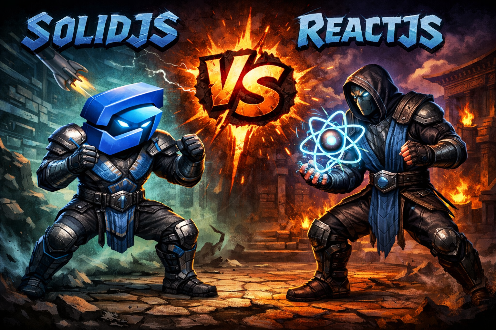

# SolidJS vs React (2026)

React остаётся стандартом фронтенда де-факто, но за последние пару лет вокруг SolidJS сложилась устойчивая репутация "фреймворка, который сделал реактивность правильно". У Solid нет виртуального DOM, компонент выполняется один раз, а обновления идут точечно — и это не маркетинговый лозунг, а следствие конкретной архитектуры. Разберёмся, в чём именно SolidJS технически превосходит React, что по этому поводу говорят актуальные бенчмарки и опросы 2025–2026 годов, и — без прикрас — где React по-прежнему выигрывает за явным преимуществом.

## Реактивность: сигналы против виртуального DOM

Ключевое архитектурное отличие лежит в основе рендеринга. В React компонент — это функция, которая перевыполняется целиком при каждом изменении состояния, а результат сравнивается с предыдущим деревом через виртуальный DOM и алгоритм diffing, после чего в реальный DOM вносятся точечные патчи. Это удобная модель программирования, но она платит вычислительным налогом на каждое обновление — даже если изменилось одно текстовое поле в глубоко вложенном дереве.

SolidJS устроен принципиально иначе: JSX компилируется в обычные вызовы создания DOM-узлов, а состояние живёт в сигналах (`createSignal`), которые компонент читает один раз при первом рендере. Дальше тело функции-компонента больше не выполняется повторно — вместо этого создаются точечные реактивные подписки: конкретный узел DOM подписывается напрямую на конкретный сигнал и обновляется в обход какого-либо сравнения деревьев. Разработчики называют это fine-grained reactivity — "мелкозернистой" реактивностью, в противовес "крупнозернистому" перерендеру компонентов у React. Один из комментаторов бета-версии Solid 2.0 формулирует это без обиняков: ["у Solid всегда была лучшая модель реактивности среди JS-фреймворков — настоящие точечные обновления без виртуального DOM"](https://www.infoq.com/news/2026/05/solidjs-2-async/), и это не пустая похвала, а прямое следствие архитектуры без diffing-прохода.

Показательно, что сигналы — это не маргинальная идея одного фреймворка, а концепция, которую переняли даже конкуренты. Angular официально признал, что его собственная модель реактивности на сигналах (`signal()`, `computed()`, `effect()`) вдохновлена в том числе SolidJS — в [RFC по Angular Signals](https://github.com/angular/angular/discussions/49685) команда Angular прямо благодарит создателя Solid Райана Карниато за опыт и консультации, которыми он делился в процессе проектирования. Когда фреймворк калибра Angular, исторически завязанный на Zone.js и собственную модель change detection, пересматривает архитектуру в сторону идей Solid — это весомее любых маркетинговых заявлений о превосходстве конкретной реализации.

Практическое следствие: в React разработчику приходится вручную или через React Compiler защищаться от лишних перерендеров, тогда как в Solid лишнего перерендера просто структурно не существует — обновляется только тот DOM-узел, который реально зависит от изменившегося сигнала.

## Что говорят бенчмарки о производительности

Разница в архитектуре напрямую видна в синтетических тестах. Эталонный [js-framework-benchmark Стефана Крауса](https://github.com/krausest/js-framework-benchmark) — самый цитируемый независимый бенчмарк фронтенд-фреймворков — годами показывает одну и ту же картину: SolidJS стабильно держится в верхней группе результатов, вплотную к "чистому" VanillaJS без фреймворка, тогда как React заметно отстаёт в сценариях с частыми точечными обновлениями, большими списками и глубоко вложенными деревьями компонентов — это подтверждает и [актуальный обзор состояния Solid.js в 2026 году](https://listiak.dev/blog/the-state-of-solid-js-in-2026-signals-performance-and-growing-influence), опирающийся на данные бенчмарка. По оценке аналитического разбора [Boundev](https://www.boundev.ai/blog/solidjs-vs-react-performance-comparison), в сценариях, характерных именно для js-framework-benchmark (создание, обновление и удаление тысяч строк), SolidJS показывает выигрыш в раннтайм-производительности порядка 50–70% относительно React — важно понимать, что это не универсальная константа "на любом сайте", а результат именно синтетических update-heavy тестов, где разница между fine-grained реактивностью и виртуальным DOM видна нагляднее всего.

Отдельно стоит подчеркнуть: на реальных продуктовых интерфейсах, где большая часть времени уходит на сеть, изображения и сторонний JS, а не на диффинг DOM, разрыв обычно куда скромнее, чем в лабораторных тестах — и React Compiler (подробнее ниже) заметно сокращает и его.

## Размер бандла

Fine-grained-реактивность даёт SolidJS ещё один побочный эффект — компилятор Solid превращает JSX в прямые DOM-инструкции без необходимости тащить в рантайм движок диффинга виртуального DOM, поэтому сам фреймворк получается заметно легче. По данным [обзора состояния Solid.js в 2026 году](https://listiak.dev/blog/the-state-of-solid-js-in-2026-signals-performance-and-growing-influence), ядро Solid весит порядка **7,6 КБ** в minified+gzip виде против примерно **45 КБ** у связки React + ReactDOM, **38 КБ** у Vue и **85+ КБ** у Angular. Тот же источник, ссылаясь на кейс компании Radware, приводит и пример из реального продакшена: при сопоставимом по функциональности приложении бандл на SolidJS занял около 80 КБ против примерно 290 КБ на React. Похожую картину — итоговый gzip-размер собранного приложения порядка 9 КБ для типового weather-приложения на Solid — показывает и независимый [проект framework-benchmarks.as93.net](https://framework-benchmarks.as93.net/solid/), который строит идентичное приложение на разных фреймворках специально для честного сравнения размеров сборки.

Для проектов, где критична скорость первой загрузки на слабых сетях и устройствах — это не абстрактная экономия, а вполне измеримые миллисекунды на Time to Interactive.

## React Compiler: React отвечает ударом

Несправедливо было бы описывать React таким, каким он был в 2023 году. [7 октября 2025 года команда React объявила о выходе React Compiler 1.0](https://react.dev/blog/2025/10/07/react-compiler-1) — билд-тайм компилятора, который автоматически расставляет мемоизацию по дереву компонентов, беря на себя работу, которую раньше вручную делали `useMemo`, `useCallback` и `React.memo`. По данным того же официального анонса, на реальных продуктах вроде Meta Quest Store компилятор дал прирост до **12%** на первичной загрузке и кросс-страничных переходах и ускорение отдельных интераций более чем в **2,5 раза** — при нейтральном потреблении памяти. К 2026 году React Compiler считается дефолтной практикой для новых React-проектов, а его правила зашиты прямо в рекомендованный пресет `eslint-plugin-react-hooks`.

Это не отменяет фундаментальной разницы в архитектуре — React Compiler всё ещё работает поверх модели "перевыполнить компонент целиком, но избежать лишней работы за счёт мемоизации", а не поверх точечных сигналов, — но заметно сокращает практический разрыв в проде и снимает с разработчика значительную часть ручной оптимизации, которая раньше была источником багов из-за забытых зависимостей в массивах `useMemo`/`useCallback`.

## Developer experience: сигналы удобны, но не без сюрпризов

Синтаксис Solid сознательно похож на React — JSX, хуки-подобные примитивы (`createSignal`, `createEffect`, `createMemo`), компонентный подход — поэтому переход для React-разработчика ощущается мягче, чем, скажем, переход на Vue с его шаблонами и SFC. Но модель без перерендера компонента приносит и собственные грабли, которые не встретишь в React.

Главный источник ошибок новичков — деструктуризация пропсов. В React `const { name } = props` — обычная практика. В Solid пропсы реализованы через геттеры именно ради точечной реактивности, поэтому деструктуризация "на входе" в компонент разрывает реактивную связь и замораживает значение на момент первого вызова. [Разбор практических подводных камней Solid.js](https://vladislav-lipatov.medium.com/solidjs-pain-points-and-pitfalls-a693f62fcb4c) перечисляет и другие неочевидные моменты: вызов произвольной функции внутри `createEffect` неявно подписывает эффект на все сигналы, которые эта функция читает (что иногда требует оборачивания в `untrack`), директивы неудобно переиспользовать между файлами из-за особенностей работы TypeScript-компилятора, а `resource`-примитивы не поддерживают частичное обновление вложенных полей — смена одного свойства объекта пересоздаёт его целиком и лишний раз триггерит зависимые эффекты. Это не критичные проблемы, но они требуют времени на привыкание и не всегда интуитивны для разработчика с чисто React-бэкграундом.

Из плюсов — ощутимо меньше специфичных для React ограничений: не нужно помнить "правила хуков" (нельзя вызывать хук условно или в цикле), потому что примитивы Solid не завязаны на порядок вызовов внутри рендера, а сам компонент, выполняющийся один раз, устраняет целый класс багов, связанных со stale closures в `useEffect`.

Отдельно стоит сказать про TypeScript — и здесь у Solid объективное структурное преимущество. Solid написан на TypeScript с нуля, и типы для всех примитивов ([`createSignal`](https://github.com/solidjs/solid/discussions/980), `createEffect`, `createMemo`, JSX-компонентов) поставляются прямо внутри пакета `solid-js` — я проверил его `package.json` напрямую через npm registry: там есть поле `"types": "types/index.d.ts"`, указывающее на встроенные декларации, а отдельного пакета `@types/solid-js` в реестре попросту не существует. У React ситуация иначе: в его собственном `package.json` поля `types` нет вообще — типизация живёт в стороннем пакете `@types/react`, который [сам React.dev описывает](https://react.dev/learn/typescript) как экспортированный из **DefinitelyTyped**, то есть поддерживаемый сообществом, а не командой React напрямую. На практике это означает, что типы для React могут временно расходиться с рантаймом при выходе новых версий (типичный пример — задержки с типами для новых хуков), тогда как у Solid типы и рантайм всегда одной версии по построению, потому что это буквально один и тот же пакет.

## Экосистема и рынок: где React выигрывает уверенно

Здесь честность требует признать: по охвату и зрелости экосистемы React пока вне конкуренции, и разрыв не в пользу Solid — заметный на порядки.

**Опросы разработчиков.** По данным [State of JavaScript 2025](https://2025.stateofjs.com/en-US/libraries/front-end-frameworks/), React остаётся самым используемым фронтенд-фреймворком — [83,6% респондентов](https://www.infoq.com/news/2026/03/state-of-js-survey-2025/) применяют его в работе, тогда как SolidJS используют около 10%. При этом Solid уже пятый год подряд удерживает самый высокий рейтинг удовлетворённости среди фреймворков — разработчики, попробовавшие его, реже хотят вернуться к альтернативам, но абсолютное большинство рынка по-прежнему работает на React. Тот же опрос фиксирует и обратную сторону популярности React: жалобы на сложность и на монетизационную политику вокруг Next.js/Vercel — одна из самых частых болевых точек в комментариях респондентов. Цифры это подтверждают: удовлетворённость Next.js в опросе упала с 68% до 55% на фоне растущей сложности Server Components и App Router, а сам React — при 98%-ном охвате использования — получает больше всего конкретных жалоб на отдельные API: `useEffect` набрал самый низкий рейтинг удовлетворённости среди всех хуков, с проблемами массива зависимостей на втором месте (21% недовольных). Иными словами, падает не популярность React как таковая — она остаётся доминирующей — а именно удовлетворённость работой с ним и его флагманским мета-фреймворком.

**GitHub.** Разрыв в размере сообщества виден и по репозиториям: у [facebook/react](https://github.com/facebook/react) порядка 247 тысяч звёзд против примерно 35,7 тысяч у [solidjs/solid](https://github.com/solidjs/solid) — почти семикратная разница, отражающая масштаб контрибьюторской базы и внешнего внимания.

**Рынок труда.** Разрыв в вакансиях ещё резче, чем в звёздах на GitHub: React фактически стал минимальным требованием в описаниях фронтенд-вакансий крупных компаний, а сообщество разработчиков SolidJS остаётся нишевым — вакансий на порядок меньше, и найм в основном идёт через нишевые площадки вроде [SolidJS Jobs Listing](https://rrjanbiah.github.io/solidjs-jobs/), а не через мейнстримовые борды.

**Готовые решения.** У React есть Next.js, Remix/React Router, React Native для мобильной разработки, десятки зрелых UI-кит-библиотек и многолетний пласт готовых ответов на Stack Overflow — то, что в Solid часто приходится решать самостоятельно или ждать, пока экосистема догонит. Метафреймворк SolidStart, аналог Next.js для Solid, всё ещё находится в активной разработке: на начало 2026 года вышла версия [SolidStart 2.0.0-alpha.2](https://listiak.dev/blog/the-state-of-solid-js-in-2026-signals-performance-and-growing-influence), тогда как экосистема Next.js насчитывает годы продакшен-эксплуатации в компаниях калибра Vercel, Nike, TikTok и десятков других. Для команд, которым важна предсказуемость найма, стабильность API и обилие готовых интеграций, это весомый (и часто решающий) аргумент в пользу React — вне зависимости от архитектурных преимуществ конкурента.

Здесь стоит сделать оговорку про нативные приложения отдельно от веба: у React есть React Native, а прямого фреймворкового аналога для мобильной разработки у Solid нет — зато альтернатива на другом стеке есть, и она закрывает не только десктоп. SolidJS хорошо сочетается с [Tauri](https://github.com/tauri-apps/tauri) — Rust-обёрткой, которая рендерит фронтенд на любом веб-фреймворке, но вместо Chromium из Electron использует системный WebView, что даёт кратно меньшие бинарники и потребление памяти. Со стабильным релизом [Tauri 2.0](https://v2.tauri.app/blog/tauri-20/) фреймворк перестал быть чисто десктопным: он официально поддерживает и iOS, и Android из того же кодового стека — на iOS это WKWebView, на Android — системный Android WebView, то есть теоретически одно Solid-приложение можно собрать на все пять платформ (Windows, macOS, Linux, iOS, Android) сразу. Мобильная часть моложе десктопной и на местах ещё шероховата — есть нюансы с плагинами, подписью приложений и особенностями webview, — но она уже пригодна для продакшена, а не просто proof-of-concept. Есть официальные и сообществом поддерживаемые стартовые шаблоны Tauri + Solid ([riipandi/tauri-start-solid](https://github.com/riipandi/tauri-start-solid), [ZanzyTHEbar/SolidJSTauri](https://github.com/ZanzyTHEbar/SolidJSTauri), а для мобильной сборки — отдельно [SolidJSTauriMobile](https://github.com/ZanzyTHEbar/SolidJSTauriMobile)), а разбор связки Rust + SolidJS + Tauri для кросс-платформенных приложений выходил и на [LogRocket Blog](https://blog.logrocket.com/rust-solid-js-tauri-desktop-app/). Электрон пока вне конкуренции по зрелости и охвату на десктопе — порядка 4,95 млн загрузок `electron` из npm за неделю против примерно 1,96 млн у `@tauri-apps/cli` (данные npm registry на 13–19 июля 2026 года), да и по звёздам на GitHub Electron всё ещё немного впереди (122 тыс. против 109 тыс. у [tauri-apps/tauri](https://github.com/tauri-apps/tauri)). Но разрыв заметно уже, чем в вебе, а сам факт, что Tauri из нишевого десктопного проекта за пару лет дорос до полноценной кросс-платформенной альтернативы Electron и React Native одновременно, делает связку Solid + Tauri по-настоящему быстрорастущим и разумным выбором там, где раньше у SolidJS был структурный пробел по сравнению с React.

## SolidJS 2.0 и SolidStart: куда идёт фреймворк

Проект не стоит на месте. [15 мая 2026 года вышла бета SolidJS 2.0](https://www.infoq.com/news/2026/05/solidjs-2-async/) — первый крупный релиз, делающий асинхронность гражданином первого класса прямо в реактивном графе: вычисления теперь могут напрямую возвращать промисы, а фреймворк сам разруливает подвешивание и возобновление без обвязки поверх `Suspense`. Из релиза также ушёл прежний `Suspense` в пользу более простого `Loading`, ответственного только за первичную готовность поддерева, добавлены `action()` и `createOptimisticStore` для мутаций, а запись сигналов теперь батчится на уровне микротаска — рефакторинг, который создатель фреймворка [Райан Карниато (Ryan Carniato)](https://www.infoq.com/news/2026/05/solidjs-2-async/) защищает как результат более чем годичного анализа альтернативных подходов, несмотря на то, что часть сообщества находит новый split-phase API `createEffect` более громоздким на первый взгляд.

Текущая стабильная линейка — 1.9.x (по данным [обзора состояния Solid.js в 2026 году](https://listiak.dev/blog/the-state-of-solid-js-in-2026-signals-performance-and-growing-influence), актуальная версия — 1.9.11), поэтому бета 2.0 пока не рекомендуется для новых продакшен-проектов — но сам факт, что фреймворк продолжает получать архитектурные инвестиции, а не законсервировался на "стабильной, но забытой" версии 1.x, говорит в пользу его дальнейшей жизнеспособности.

## Итог: когда выбирать что

Технически SolidJS во многом действительно лучше React: мелкозернистая (fine-grained) реактивность без виртуального DOM устраняет целый класс проблем с перерендерами, синтетические бенчмарки вроде js-framework-benchmark стабильно ставят Solid в один ряд с vanilla JS, а бандл получается в разы легче при сопоставимой функциональности. Это не голословный энтузиазм фанатов — это прямое следствие архитектуры компиляции JSX в точечные DOM-операции вместо цикла "перерендерить и сравнить".

Но "технически лучше" и "правильный выбор для вашей команды прямо сейчас" — разные вопросы. React Compiler заметно сократил практический разрыв в производительности на реальных продуктах, а экосистема, рынок труда и просто масса готовых решений вокруг React остаются на порядок больше, чем у Solid — это не мелочь, а фактор, который определяет скорость разработки и риски найма на годы вперёд. Если вы стартуете личный или небольшой коммерческий проект, где производительность и малый бандл критичны, а гибкость в подборе библиотек не так важна — SolidJS сегодня зрелый и оправданный выбор. Если вы работаете в большой команде, зависите от обилия готовых интеграций, React Native или просто хотите не думать о найме редких специалистов — React остаётся куда более безопасной ставкой, и React Compiler делает эту ставку только крепче.

## Источники

- [SolidJS 2.0 Beta: First-Class Async, Reworked Suspense and Deterministic Batching — InfoQ, май 2026](https://www.infoq.com/news/2026/05/solidjs-2-async/)
- [The state of Solid.js in 2026: signals, performance, and growing influence — Tomas Listiak](https://listiak.dev/blog/the-state-of-solid-js-in-2026-signals-performance-and-growing-influence)
- [js-framework-benchmark — Stefan Krause, GitHub](https://github.com/krausest/js-framework-benchmark)
- [SolidJS vs React Performance Comparison — Boundev](https://www.boundev.ai/blog/solidjs-vs-react-performance-comparison)
- [Framework Benchmarks: Solid.js — as93.net](https://framework-benchmarks.as93.net/solid/)
- [React Compiler v1.0 — официальный блог React, 7 октября 2025](https://react.dev/blog/2025/10/07/react-compiler-1)
- [React Versions — react.dev](https://react.dev/versions)
- [SolidJS pain points and pitfalls — Vladislav Lipatov, Medium](https://vladislav-lipatov.medium.com/solidjs-pain-points-and-pitfalls-a693f62fcb4c)
- [State of JavaScript 2025: Front-end Frameworks](https://2025.stateofjs.com/en-US/libraries/front-end-frameworks/)
- [State of JavaScript 2025: Survey Reveals a Maturing Ecosystem — InfoQ, март 2026](https://www.infoq.com/news/2026/03/state-of-js-survey-2025/)
- [facebook/react — GitHub](https://github.com/facebook/react)
- [solidjs/solid — GitHub](https://github.com/solidjs/solid)
- [SolidJS Jobs Listing & SolidJS Developers/Freelancers Listing](https://rrjanbiah.github.io/solidjs-jobs/)
- [tauri-apps/tauri — GitHub](https://github.com/tauri-apps/tauri)
- [riipandi/tauri-start-solid — GitHub](https://github.com/riipandi/tauri-start-solid)
- [ZanzyTHEbar/SolidJSTauri — GitHub](https://github.com/ZanzyTHEbar/SolidJSTauri)
- [ZanzyTHEbar/SolidJSTauriMobile — GitHub](https://github.com/ZanzyTHEbar/SolidJSTauriMobile)
- [Rust, SolidJS, and Tauri: Create a cross-platform desktop app — LogRocket Blog](https://blog.logrocket.com/rust-solid-js-tauri-desktop-app/)
- [Tauri 2.0 Stable Release — официальный блог Tauri](https://v2.tauri.app/blog/tauri-20/)
- [RFC: Angular Signals — обсуждение angular/angular на GitHub](https://github.com/angular/angular/discussions/49685)
- [@tauri-apps/cli — npm download stats](https://api.npmjs.org/downloads/point/last-week/@tauri-apps/cli)
- [electron — npm download stats](https://api.npmjs.org/downloads/point/last-week/electron)
- [Using TypeScript — react.dev](https://react.dev/learn/typescript)
- [TypeScript — SolidJS Documentation](https://docs.solidjs.com/configuration/typescript)
- [solid-js — npm registry](https://registry.npmjs.org/solid-js/latest)
- [react — npm registry](https://registry.npmjs.org/react/latest)
- [State of React 2025: Features](https://2025.stateofreact.com/en-US/features/)
